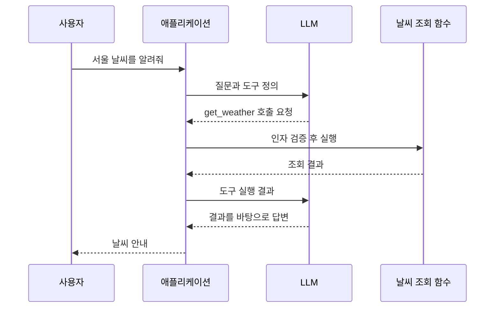
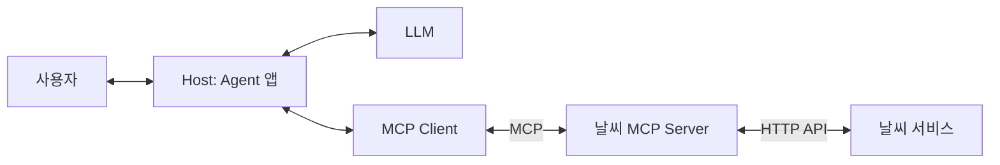

## 도구를 호출할 수 있는데 MCP는 왜 필요할까?

[LangChain.js로 DB와 API를 사용하는 Agent 만들기](/posts/langchain-js-db-api-agent/)에서는 애플리케이션에 도구를 등록하고, 모델이 필요한 도구를 선택하도록 구성했다. MCP 없이도 데이터베이스 조회와 날씨 API 호출을 연결할 수 있었다.

그렇다면 MCP를 사용하면 무엇이 달라질까?

**Tool Calling은 모델이 도구 이름과 인자를 구조화해 요청하는 과정이고, MCP는 AI 애플리케이션과 도구·데이터 제공자 사이의 통신 규약이다.** 함께 사용할 수 있지만 맡는 역할이 다르다.

이 글은 날씨 조회를 예로 들어 두 개념을 구분한다. 메시지와 구조도는 설명용이며, 기존 Agent 예제를 MCP로 전환해 실행한 결과는 아니다. MCP 메시지는 공식 명세의 2025-06-18 버전을 기준으로 설명한다.

## 1. Tool Calling에서 모델은 무엇을 할까?

애플리케이션은 모델에 도구의 이름, 설명, 입력 형식을 알려준다. 모델은 질문과 도구 설명을 바탕으로 호출할 도구와 인자를 반환할 수 있다.

예를 들어 사용자가 “서울 날씨를 알려줘”라고 요청하면, 호출 의도를 다음처럼 표현할 수 있다. 아래는 특정 모델 API의 전체 응답 형식이 아닌 개념 예시다.

```json
{
  "name": "get_weather",
  "arguments": {
    "city": "서울"
  }
}
```

이 JSON 자체가 날씨 API를 실행하지는 않는다. 사용자 정의 도구를 앱에서 실행하는 일반적인 구성에서는 애플리케이션이 호출 요청을 받아 함수를 실행하고, 결과를 모델에 돌려준다. 모델은 그 결과를 이용해 답하거나 추가 도구를 요청한다. [Anthropic의 도구 호출 처리 문서](https://platform.claude.com/docs/en/agents-and-tools/tool-use/handle-tool-calls)



SDK나 Agent 프레임워크가 이 반복을 대신 처리해도 역할은 같다. 모델의 호출 요청과 실제 실행은 구분된다. 서비스 제공자가 직접 실행하는 도구도 있으므로, 사용하는 API에서 실행 주체가 누구인지 확인해야 한다.

## 2. MCP는 도구 연결을 어떻게 바꿀까?

MCP는 Model Context Protocol의 약자다. 주요 구성 요소는 다음과 같다.

| 구성 요소 | 역할 | 예시 |
|---|---|---|
| Host | 모델 사용과 사용자 상호작용, 도구 접근을 조율하는 AI 애플리케이션 | 채팅 앱, IDE, 직접 만든 Agent 앱 |
| Client | Host 안에서 특정 MCP Server와 연결을 유지하는 구성 요소 | 앱에 내장된 MCP 연결 모듈 |
| Server | 도구나 데이터를 MCP 규약으로 제공하는 프로그램 | 날씨 조회·문서 검색 서버 |

하나의 Host는 여러 Client를 통해 여러 Server에 연결할 수 있다. MCP Server는 별도 원격 장비를 뜻하는 말이 아니다. 같은 컴퓨터에서 실행되는 프로세스일 수도 있다. [MCP 아키텍처](https://modelcontextprotocol.io/specification/2025-06-18/architecture)

날씨 조회를 MCP Server로 제공하면 실행 경로는 다음처럼 구성할 수 있다.



Host는 서버에서 얻은 도구 정의를 모델이 사용할 수 있는 형식으로 연결한다. 이후 모델이 도구를 요청하면 Client를 통해 Server에 실행을 요청하고 결과를 돌려받는다. 이 연결 과정은 프레임워크나 어댑터가 담당할 수 있다.

LLM이 반드시 MCP 통신을 직접 처리하는 것은 아니다. 모델과 대화하는 API, Client와 Server 사이의 MCP, Server가 이용하는 업무 API는 각각 다른 연결이다.

## 3. 도구 목록 조회와 도구 실행

MCP 연결에서는 초기화와 기능 협상을 거친 뒤 도구 목록을 요청하고 도구를 호출할 수 있다. 도구 관련 대표 메서드는 두 가지다.

| 메서드 | 용도 |
|---|---|
| `tools/list` | 서버가 제공하는 도구의 이름·설명·입력 스키마 조회 |
| `tools/call` | 도구 이름과 인자를 전달해 실행 요청 |

예를 들어 이미 연결된 서버에 보내는 호출 메시지는 다음 형태다.

```json
{
  "jsonrpc": "2.0",
  "id": 7,
  "method": "tools/call",
  "params": {
    "name": "get_weather",
    "arguments": {
      "city": "서울"
    }
  }
}
```

앞서 본 모델의 호출 의도와 여기의 MCP 메시지는 같은 메시지가 아니다. Host 측 연결 코드가 모델의 요청을 해당 서버의 호출로 이어준다. 실행 결과도 모델 API가 받는 형식으로 전달해야 한다. [MCP Tools 명세](https://modelcontextprotocol.io/specification/2025-06-18/server/tools)

도구 목록을 가져왔다고 모든 도구를 모델에 한꺼번에 전달해야 하는 것도 아니다. 어떤 도구를 노출할지는 애플리케이션의 구성과 정책에 따라 정할 수 있다.

## 4. API, Tool Calling, MCP의 관계

날씨 조회 하나에도 세 가지 개념이 함께 등장한다.

| 구분 | 답하는 질문 | 날씨 조회 예시 |
|---|---|---|
| 업무 API | 실제 데이터를 어디서 어떻게 얻는가? | 날씨 서비스의 HTTP 엔드포인트 |
| Tool Calling | 모델이 어떤 기능을 어떤 인자로 요청하는가? | `get_weather(city="서울")` |
| MCP | 앱과 도구 제공자가 어떤 규약으로 통신하는가? | 도구 목록 조회와 호출 메시지 |

MCP Server 내부에서 기존 REST API나 데이터베이스를 이용할 수 있다. 기존 API를 없애야 MCP를 도입할 수 있는 것은 아니다.

반대로 애플리케이션 안에서 날씨 함수를 직접 실행하는 구성도 유효하다. MCP를 추가한다면 연결 규약과 서버 운영이라는 계층이 더해지므로, 재사용의 이점과 관리 비용을 함께 판단한다.

## 5. 기존 Agent 예제에 MCP를 붙인다면

기존 글의 `get_weather` 도구를 여러 AI 애플리케이션에서 사용하려는 상황을 가정해보자.

| 항목 | 앱에 함수를 직접 등록 | MCP Server로 분리 |
|---|---|---|
| 도구 정의 | 앱 코드에서 등록 | 서버가 제공하고 앱이 조회 |
| 실행 경로 | 앱이 함수를 호출 | Client가 Server에 실행 요청 |
| 업무 로직 | 앱과 같은 코드베이스에 둘 수 있음 | 서버 측에 모아 관리할 수 있음 |
| 연결 관리 | 함수 호출 중심 | 서버 시작·접속·연결 오류 처리 필요 |
| 다른 앱에서 이용 | 코드나 라이브러리 공유 등으로 연결 | MCP 지원 앱에서 서버 연결을 재사용 가능 |

이 상황이라면 날씨 조회 로직과 도구 스키마를 Server 쪽으로 옮기고, Agent 앱에는 Client 연결을 추가할 수 있다. 질문을 해석하고 도구 결과로 답하는 과정은 여전히 남는다.

다만 MCP 지원 여부만으로 모든 앱에서 같은 기능이 보장되지는 않는다. 전송 방식, 인증, 지원하는 프로토콜 기능과 스키마 처리 범위가 맞는지 확인해야 한다.

## 6. 언제 직접 연결하고, 언제 MCP를 고려할까?

아래는 도입을 판단하기 위한 기준이다.

- **하나의 앱에서 소수의 기능만 사용한다면** 직접 도구를 등록하는 방식으로 시작하기 쉽다. 실행 경로가 짧고 디버깅할 구성 요소도 적다.
- **여러 AI 앱이 같은 업무 기능을 사용한다면** MCP Server로 제공해 앱마다 만드는 연결 코드를 줄일 수 있는지 검토한다.
- **도구 제공 팀과 앱 개발 팀이 다르다면** 서버의 도구 계약과 변경 관리를 분리하는 구성이 도움이 될 수 있다.
- **기존 공통 라이브러리나 API만으로 충분하다면** MCP를 추가했을 때 실제로 줄어드는 작업이 무엇인지 먼저 확인한다.

MCP를 붙이는 것만으로 모델의 도구 선택 정확도가 올라가는 것은 아니다. 도구 설명이 모호하거나 비슷한 기능이 겹치면 모델은 여전히 잘못된 도구나 인자를 선택할 수 있다. 적절한 도구 설계와 업무별 평가가 필요하다.

## 7. 폐쇄망에서도 사용할 수 있을까?

MCP 자체가 외부 인터넷 연결을 요구하지는 않는다. 명세는 로컬 프로세스의 표준 입출력을 사용하는 `stdio`와 HTTP 기반의 `Streamable HTTP` 전송 방식을 정의한다. [MCP 전송 방식](https://modelcontextprotocol.io/specification/2025-06-18/basic/transports)

따라서 내부 LLM, Host, MCP Server, 업무 API를 내부망에서 운영하는 구성을 생각할 수 있다. 다만 사용하는 서버 구현이 외부 API나 패키지 다운로드에 의존한다면 그 의존성은 별도로 해결해야 한다. MCP를 지원한다는 사실과 오프라인에서 동작한다는 사실은 구분한다.

위 구성은 가능한 설계 예시이며, 이 글에서 특정 폐쇄망 환경의 설치와 실행을 검증한 것은 아니다.

## 8. 연결 이후에도 남는 실행 책임

모델이 생성한 인자는 실제 업무 처리 전에 검증해야 한다. MCP Tools 명세도 서버의 입력 검증과 접근 제어를 요구한다. 도구 연결이 성공했다는 것이 해당 사용자의 모든 작업 권한을 의미하지는 않는다. [MCP 도구 실행 요구 사항](https://modelcontextprotocol.io/specification/2025-06-18/server/tools#security-considerations)

예를 들어 조회 도구는 허용된 데이터 범위와 결과 건수를 제한할 수 있다. 데이터를 변경하는 도구라면 실행 전 확인과 중복 요청 처리를 설계할 수 있다. 타임아웃 뒤에 무조건 재호출하면 같은 작업이 두 번 실행될 수 있기 때문이다.

도구 설명에는 사용 목적과 인자의 의미를 명확히 적고, 실행 결과에는 모델이 답변에 필요한 정보를 담는다. 실패한 호출을 성공처럼 전달하지 않는 것도 중요하다.

## 역할을 나누면 도입 목적도 명확해진다

Tool Calling을 이해하면 모델의 요청과 프로그램의 실행을 구분할 수 있다. MCP를 이해하면 그 프로그램을 AI 애플리케이션에 연결하는 경로를 설계할 수 있다.

먼저 필요한 업무 기능을 도구로 정의하고 동작을 확인한다. 이후 여러 앱에서 재사용하거나 도구 제공을 별도로 관리할 필요가 생기면 MCP를 검토한다. 기존 [LangChain.js Agent 예제](/posts/langchain-js-db-api-agent/)와 함께 보면, 도구 실행 흐름에서 어떤 부분을 분리할 수 있는지 연결해서 이해하기 좋다.
