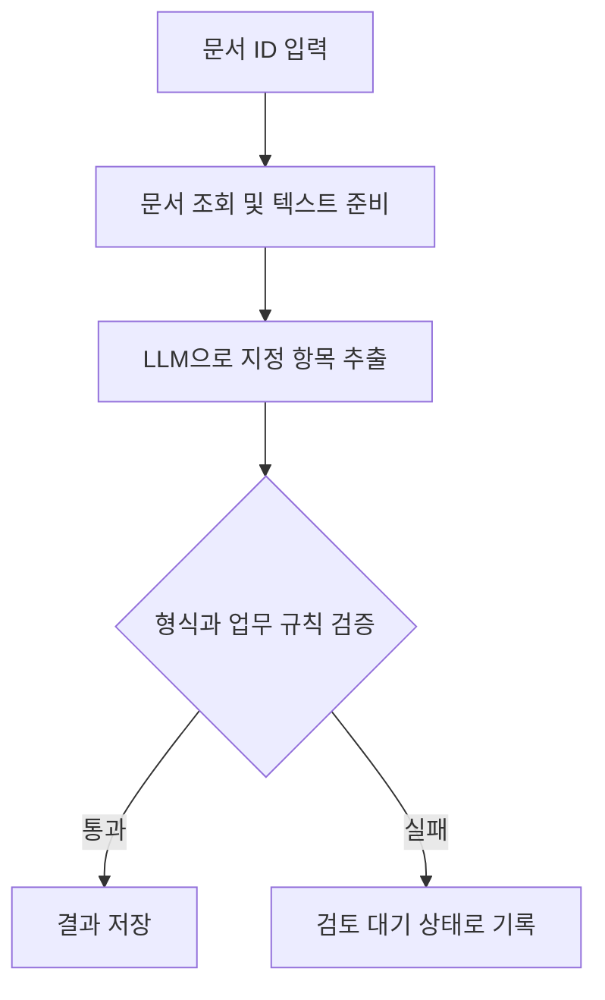
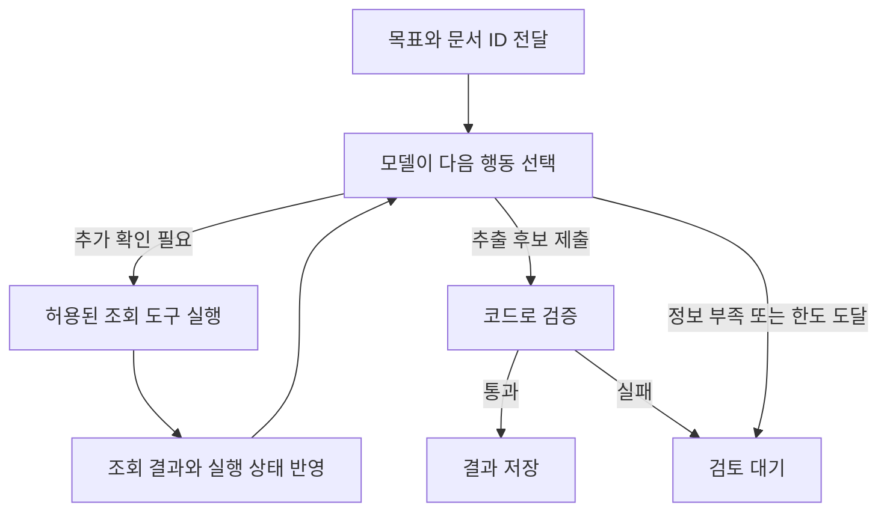
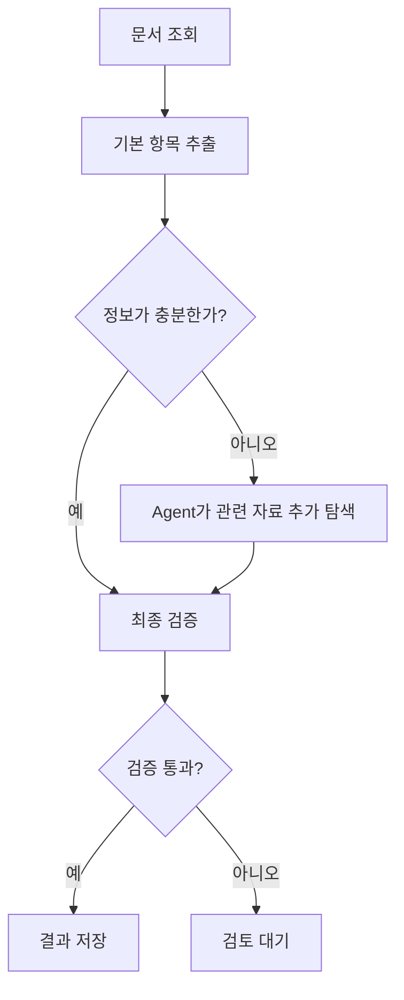

## 도구를 연결했다면, 실행 순서는 누가 정할까?

앞선 [Tool Calling과 MCP 글](/posts/tool-calling-and-mcp/)에서는 모델이 도구를 요청하는 과정과 애플리케이션이 도구에 연결하는 방식을 구분했다. 도구를 사용할 수 있게 되면 다음 질문이 남는다.

**어떤 도구를 어떤 순서로 실행하고, 언제 작업을 끝낼 것인가?**

이 흐름을 미리 정한 절차로 제어할 수도 있고, 모델이 중간 결과를 보고 다음 행동을 선택하게 할 수도 있다. 이 글에서는 각각을 Workflow와 Agent로 구분한다. 용어의 사용 범위는 제품마다 다르므로, 이름보다 실제 실행 구조를 보는 것이 중요하다.

문서에서 필요한 정보를 찾아 저장하는 가상의 업무를 두 방식으로 비교해보자. 아래 구조와 기준은 설계 예시이며, 특정 업무 시스템의 구현 결과나 성능 측정값은 아니다.

## 1. Workflow와 Agent를 구분하는 기준

Anthropic은 미리 정의한 코드 경로로 모델과 도구를 조율하는 구조를 Workflow, 모델이 실행 과정과 도구 사용을 동적으로 이끄는 구조를 Agent로 구분한다. 이 글도 이 구분을 따른다. [Building effective agents](https://www.anthropic.com/engineering/building-effective-agents)

| 구분 | Workflow | Agent |
|---|---|---|
| 실행 흐름 | 정해진 단계와 전이 규칙을 따름 | 중간 결과를 보고 모델이 다음 행동을 선택 |
| 모델의 역할 | 분류·추출·요약 등 단계별 처리 | 처리 내용과 함께 도구 선택·추가 탐색 등을 판단 |
| 반복과 분기 | 개발자가 정한 조건과 경로 안에서 수행 | 허용된 도구와 한도 안에서 실행 경로가 달라짐 |
| 종료 | 완료 단계 도달, 검증 실패 등 정해진 조건 | 모델의 완료 판단과 시스템의 종료 조건을 함께 사용 |

Workflow에도 LLM, 조건 분기, 재시도가 들어갈 수 있다. 모델이 문서 유형을 분류하고 그 결과에 따라 미리 정의된 경로로 보내는 것도 Workflow의 한 형태다. 반대로 Agent에도 최대 실행 횟수와 접근 가능한 도구 같은 제약이 있다. [LangGraph의 Workflow·Agent 설명](https://docs.langchain.com/oss/python/langgraph/workflows-agents)

따라서 “LLM을 사용하면 Agent”, “반복문이 있으면 Agent”라는 기준으로 나누기는 어렵다. **모델에게 실행 경로를 결정할 권한을 얼마나 주었는지**를 살펴봐야 한다.

## 2. 같은 업무를 Workflow로 구성하기

다음 업무를 가정하자.

> 문서 ID를 입력받아 문서를 조회하고, 거래처명·문서 날짜·합계 금액을 추출한 뒤 검증을 통과한 결과를 저장한다.

문서 위치와 추출 항목이 정해져 있다면 다음처럼 구성할 수 있다.

이 구조에서 모델은 정보를 추출하지만, 조회와 저장의 순서를 바꾸지는 않는다. 검증을 건너뛰고 저장하는 경로도 제공하지 않는다.

예를 들어 다음 조건을 코드로 검사할 수 있다.

- 날짜가 정해진 형식으로 해석되는가?
- 금액이 숫자이며 업무에서 허용하는 범위에 있는가?
- 필수 항목이 모두 존재하는가?
- 같은 문서가 이미 처리됐는가?

다만 형식 검증을 통과했다고 추출값이 원문과 일치한다는 보장은 없다. 날짜 모양이 올바른 오답도 가능하다. 원문 근거를 함께 남기거나, 정답이 있는 문서로 추출 정확도를 별도로 평가해야 한다.

Workflow가 제공하는 것은 실행 절차의 예측 가능성이다. 그 안에서 사용하는 모델의 답변까지 항상 같아지는 것은 아니다.

## 3. 같은 업무를 Agent로 구성하기

문서 조회·추출·저장이라는 목표는 같지만, 필요한 정보가 어디에 있는지 일정하지 않다고 가정해보자. 기본 문서에 금액이 없으면 첨부 문서를 확인해야 하고, 같은 거래처의 정정 문서가 있는지도 살펴봐야 한다.

Agent에는 목표와 함께 문서 검색, 본문 조회, 첨부 조회 같은 도구를 제공할 수 있다. 모델은 도구 결과를 보고 추가로 무엇을 확인할지 선택한다.

한 문서는 본문 조회만으로 끝나고, 다른 문서는 첨부 조회와 검색이 추가될 수 있다. 어떤 자료를 더 읽을지 미리 모든 경로로 열거하기 어려울 때 이런 유연성이 도움이 될 수 있다.

여기서는 Agent가 저장할 후보를 제출하고, 실제 검증과 저장은 정해진 코드가 담당하도록 설계했다. 모델에게 탐색 권한을 주었다고 모든 단계의 권한을 함께 줄 필요는 없다.

또한 “충분한 정보를 찾았다”는 모델의 판단만으로 성공을 판정하지 않는다. 필수 값이 없거나 문서끼리 충돌하면 미해결 상태로 반환할 수 있어야 한다.

## 4. 유연성을 얻으면 확인할 것도 늘어난다

Agent는 입력에 따라 호출 횟수와 탐색 경로가 달라질 수 있다. 추가 탐색이 정확도를 높이는지, 불필요한 반복만 늘리는지 확인해야 한다.

가령 문서 검색이 같은 결과만 계속 반환하는데 검색어를 조금씩 바꾸며 반복한다면, 최종 답변만으로는 원인을 파악하기 어렵다. 다음 기록이 있으면 실행을 재구성하기 쉽다.

| 기록할 항목 | 확인할 수 있는 문제 |
|---|---|
| 도구 이름과 입력 인자 | 잘못된 문서 조회, 불필요한 반복 |
| 도구 결과의 상태와 출처 | 조회 실패, 근거 없는 추출 |
| 단계별 소요 시간과 호출 수 | 특정 API 지연, 지나친 모델 호출 |
| 종료 상태 | 완료, 정보 부족, 시간 초과 구분 |

모델의 숨겨진 사고 과정을 수집할 필요는 없다. 실제 호출·결과·검증 기록으로 업무 처리를 추적한다. 원문에 민감한 정보가 있다면 로그에 남길 범위도 정한다.

실행 한도는 프롬프트에 요청하는 데서 끝내지 않고 시스템에서 적용한다. 예를 들어 조회 횟수나 전체 실행 시간을 제한하고, 초과하면 확보한 근거와 미해결 항목을 반환하도록 설계할 수 있다. 구체적인 한도는 업무 평가 결과로 정한다.

## 5. Workflow 안에 Agent를 넣을 수도 있다

전체 업무를 한 방식으로 통일할 필요는 없다. LangChain 문서도 Workflow의 한 단계에서 Agent를 호출하는 구성을 설명한다. [Custom workflow](https://docs.langchain.com/oss/python/langchain/multi-agent/custom-workflow)

문서 처리에서는 기본 절차를 유지하면서 예외 탐색만 Agent에 맡기는 방식을 생각할 수 있다.

이 설계에서는 문서 접수와 결과 저장 절차를 고정하고, 정보가 부족한 경우에만 동적인 탐색을 허용한다. 모든 문서가 Agent의 반복 실행을 거치지 않아도 된다.

추가 탐색에 실패했을 때 돌아갈 상태도 명확해진다. 누락된 값을 임의로 채워 저장하는 대신, 어떤 필드가 해결되지 않았는지 기록해 다음 처리를 이어갈 수 있다.

## 6. Tool Calling과 MCP는 어느 쪽에서 사용할까?

[이전 글](/posts/tool-calling-and-mcp/)의 개념을 연결하면 다음처럼 구분할 수 있다.

| 개념 | 설계할 대상 |
|---|---|
| Workflow·Agent | 실행 순서와 다음 행동의 결정 방식 |
| Tool Calling | 모델이 요청할 도구와 인자의 표현 |
| MCP | 앱과 도구 제공자 사이의 연결 규약 |

Workflow도 정해진 단계에서 MCP 도구를 호출할 수 있다. Agent도 MCP 없이 앱 내부 함수만 사용할 수 있다. MCP 서버를 연결한 것만으로 전체 시스템의 실행 방식이 Agent로 바뀌지는 않는다.

도구를 몇 개 연결했는지보다, 그 도구를 선택하고 반복 실행하는 흐름이 어떻게 제어되는지를 봐야 한다.

## 7. 무엇을 선택할지 평가하는 방법

문서 처리 예제라면 먼저 단순한 추출 Workflow를 기준으로 만들고, 해결하지 못한 사례를 모아볼 수 있다. 실패 원인이 OCR 오류인지, 추출 지시가 모호한지, 추가 문서 탐색이 필요한지 구분한다.

OCR에서 숫자를 잘못 읽은 문제라면 Agent의 도구 선택 권한을 늘리는 것만으로 해결되지 않을 수 있다. 반면 문서별로 필요한 추가 자료가 달라지는 문제라면 제한된 탐색 Agent를 비교 후보로 둘 수 있다.

같은 평가 문서에 대해 다음 항목을 기록한다. 아래는 실제 측정값이 아닌 평가표 예시다.

| 항목 | 확인할 내용 |
|---|---|
| 필드 정확도 | 추출한 날짜·금액 등이 정답과 일치하는가 |
| 완료율 | 필수 필드와 검증 조건을 모두 만족하는가 |
| 미해결 처리 | 근거 부족 시 임의 값을 만들지 않는가 |
| 지연과 비용 | 완료 시간, 모델 호출 수, 토큰 사용량이 어떤가 |
| 저장 정합성 | 중복 실행이나 실패 후 재시도에 문제가 없는가 |

특히 누락 문서, 정정 문서, 서로 다른 금액이 적힌 문서처럼 경계 사례를 포함한다. [응답 속도 글](/posts/understanding-llm-response-speed/)에서 다룬 것처럼 전체 시간과 단계별 시간을 함께 보면 추가 탐색의 비용을 파악하기 쉽다.

## 판단을 맡길 구간부터 정하기

실행 절차가 명확한 업무는 정해진 흐름으로 구성하고, 자료에 따라 다음 행동이 달라져야 하는 구간에서 모델의 판단을 활용할 수 있다.

문서 처리라면 “추가로 어떤 자료를 읽을까?”와 “검증 없이 저장해도 될까?”는 서로 다른 결정이다. 앞의 판단을 모델에 맡기면서 뒤의 조건은 코드로 유지할 수 있다. 이처럼 **모델이 결정할 범위와 시스템이 보장할 절차를 나누는 것**이 Workflow와 Agent를 선택하는 출발점이다.
