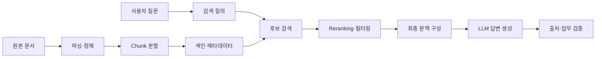
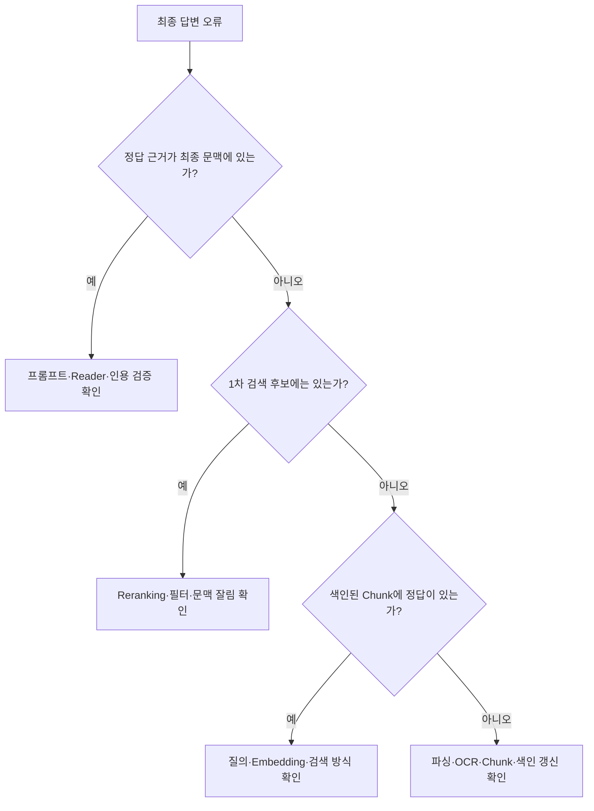

## 검색 결과가 나왔다는 것만으로는 부족하다

RAG를 처음 연결하면 질문과 비슷한 문서가 검색되는지만 확인하기 쉽다. 검색 결과 화면에 관련 문서가 보이는데도 최종 답변은 틀릴 수 있다.

예를 들어 사용자가 다음과 같이 질문했다고 하자.

> 2026년 개정 규정에서 국내 출장 숙박비 한도는 얼마인가요?

검색 결과에 출장 규정이 포함돼도 다음 문제가 남아 있다.

- 금액이 있는 표가 별도 Chunk로 잘려 검색되지 않았다.
- 2024년 규정이 2026년 규정보다 위에 배치됐다.
- 검색 후보에는 정답이 있었지만 Reranking 후 제거됐다.
- 최종 프롬프트 길이를 줄이는 과정에서 정답 부분이 잘렸다.
- 모델이 근거보다 기존 지식을 우선해 다른 금액을 답했다.

따라서 “RAG가 틀렸다”는 한 문장만으로는 고칠 지점을 찾기 어렵다. 앞선 [RAG·파인튜닝·긴 컨텍스트 비교 글](/posts/rag-fine-tuning-long-context/)에서 RAG를 선택하는 기준을 살펴봤다면, 이번에는 RAG 내부의 실패 지점을 단계별로 나눠본다.

## 1. RAG를 하나의 모델로 보지 않기

일반적인 RAG는 여러 처리 단계가 이어진 파이프라인이다.



Hugging Face의 Advanced RAG 예제도 Chunk 크기, 검색 개수, Embedding 모델, Reranking, 프롬프트와 Reader 모델처럼 조정할 부분이 많다고 설명한다. [Advanced RAG 공식 예제](https://huggingface.co/learn/cookbook/advanced_rag)

최종 답변만 평가하면 어느 단계가 문제인지 알 수 없다. 최소한 **검색 품질**과 **답변 품질**을 분리해야 한다.

## 2. 전처리 단계: 원문이 색인에 제대로 들어갔는가?

검색 이전에 원문을 읽는 과정부터 확인한다. PDF에서 보이는 내용과 파서가 추출한 텍스트는 다를 수 있다.

대표적인 오류는 다음과 같다.

- 표의 행과 열이 섞여 금액과 적용 대상의 관계가 사라짐
- 머리글과 바닥글이 본문 사이마다 반복됨
- OCR이 `1,500,000`을 `1,5OO,OOO`처럼 인식함
- 문서 제목·시행일·장절 번호가 제거됨
- 이미지로 저장된 페이지가 빈 텍스트로 처리됨
- 같은 문서의 이전 버전과 최신 버전이 함께 색인됨

이 단계에서는 모델보다 데이터부터 살펴봐야 한다. 원본 파일 몇 개를 골라 파싱된 텍스트와 직접 비교하고, 다음 정보를 보존했는지 확인한다.

| 메타데이터 | 사용하는 이유 |
|---|---|
| 문서 ID와 버전 | 중복·개정 문서를 구분 |
| 제목과 장절 | 검색 결과의 의미와 상위 구조 복원 |
| 페이지 또는 위치 | 원문 확인과 출처 표시 |
| 시행일·폐기일 | 현재 적용되는 문서 필터링 |
| 접근 등급 | 검색 전에 사용자 권한 적용 |

벡터 데이터베이스에 값이 들어갔다는 사실보다, **질문에 필요한 정보가 읽을 수 있는 형태로 들어갔는지**가 중요하다.

## 3. Chunk 분할: 정답과 조건이 떨어져 있지 않은가?

긴 문서를 검색하기 위해 작은 조각으로 나누지만, 너무 작게 자르면 의미가 분리된다.

```text
Chunk A: 제12조 국내 출장 숙박비는 다음 표에 따른다.
Chunk B: 1급지 150,000원 / 2급지 100,000원
Chunk C: 단, 기관장이 승인한 경우 실비를 지급할 수 있다.
```

질문과 가장 비슷한 Chunk A만 검색되면 조항은 찾았지만 금액은 알 수 없다. Chunk B만 검색되면 금액이 누구에게 적용되는지 모호하다. Chunk C가 빠지면 예외 조건을 누락한 답변이 만들어진다.

반대로 Chunk가 너무 크면 여러 주제가 한 벡터에 섞이고, 관련 없는 내용까지 모델 입력에 포함될 수 있다. Chunk 크기에 모든 문서에 통하는 정답은 없다.

다음 기준으로 후보를 비교한다.

- 제목과 본문을 함께 보존하는가?
- 표와 표 설명을 같은 단위로 연결하는가?
- 조항과 예외 조건이 함께 검색될 수 있는가?
- 문장 중간이나 목록 항목 중간을 자르지 않는가?
- 겹침 구간이 필요한 문맥을 보존하면서 중복을 과도하게 만들지 않는가?

구조가 있는 문서는 일정한 글자 수만으로 자르기보다 제목·문단·표 같은 요소를 활용할 수 있다. Hugging Face의 RAG 평가 예제도 너무 작은 Chunk는 답을 뒷받침하기 어렵고, 너무 큰 Chunk는 개별 의미를 희석할 수 있다고 설명한다. [RAG Evaluation 공식 예제](https://huggingface.co/learn/cookbook/rag_evaluation)

## 4. 검색 단계: 비슷한 문서가 아니라 정답 근거를 찾았는가?

검색 결과가 자연스러워 보이는 것과 정답 근거를 찾은 것은 다르다. 질문과 단어가 비슷한 안내 문서가 상위에 나오고, 실제 금액이 담긴 별표는 뒤로 밀릴 수 있다.

검색 단계는 정답 근거가 표시된 평가 질문으로 측정한다.

| 지표 | 의미 |
|---|---|
| Recall@k | 정답 근거가 상위 k개 후보 안에 포함된 질문의 비율 |
| MRR | 첫 번째 정답 근거가 얼마나 앞에 나타나는지 평가 |
| 검색 결과 수 | 후보를 너무 적게 또는 많이 가져오는지 확인 |

Recall@5가 실패했다면 생성 모델을 바꿔도 정답 근거가 입력되지 않는다. 이때는 검색 쪽을 먼저 살펴본다.

- 질문과 문서의 언어·업무 용어가 Embedding 모델에 잘 반영되는가?
- 약어와 정식 명칭을 함께 처리하는가?
- 금액·문서 번호처럼 정확한 문자열 검색이 필요한가?
- 시행일, 문서 유형, 조직, 권한 필터가 올바른가?
- 사용자 질문을 검색에 적합하게 재작성할 필요가 있는가?

의미 검색과 키워드 검색을 함께 쓰는 Hybrid Search도 후보가 될 수 있다. 다만 방식을 추가한 것만으로 개선됐다고 판단하지 않고 같은 평가 질문의 Recall과 순위를 비교한다.

## 5. Reranking: 후보에 있던 정답이 사라지지 않았는가?

검색 단계에서 많은 후보를 가져온 뒤 더 정교한 모델로 순위를 다시 매기고 일부만 남길 수 있다. 이를 Reranking이라고 한다.

```text
1차 검색: 30개 후보
        ↓
Reranking
        ↓
최종 문맥: 상위 5개
```

Reranking은 정답 근거를 위로 올릴 수 있지만, 잘못된 재정렬은 후보에 있던 정답을 제거할 수도 있다. 따라서 다음 두 결과를 모두 기록한다.

- 1차 검색 후보의 Recall@k
- Reranking 후 최종 후보의 Recall@k

1차 검색에는 정답이 있고 최종 후보에는 없다면 Reranker, 후보 수, 입력 길이 또는 점수 기준을 확인한다. 처음부터 정답이 없었다면 Reranking보다 전처리와 검색을 고쳐야 한다.

Advanced RAG 예제는 넓게 후보를 검색한 뒤 더 강한 모델로 재정렬해 최종 문서 수를 줄이는 구성을 소개한다. 중요한 것은 Reranking 사용 여부 자체가 아니라 평가 결과다.

## 6. 문맥 구성: 최종 프롬프트에 무엇이 들어갔는가?

검색 결과 로그에 정답 문서가 있어도 실제 모델 입력에 포함됐다고 단정할 수 없다.

다음 과정에서 문서가 달라질 수 있다.

- 최대 입력 길이에 맞춰 뒤쪽 문서가 잘림
- 중복 제거 과정에서 필요한 Chunk가 함께 제거됨
- 문맥 압축이 숫자나 예외 조건을 생략함
- 템플릿 조립 오류로 일부 문서가 빠짐
- 대화 이력과 도구 설명이 공간을 차지해 검색 문서가 축소됨

디버깅할 때는 검색 API의 결과뿐 아니라 **모델에 최종 전달한 프롬프트의 문서 ID와 본문**을 확인한다. 민감한 원문을 로그에 그대로 저장할 수 없다면 문서 ID, Chunk ID, 해시, 토큰 수와 잘림 여부를 기록한다.

문서마다 출처와 버전을 구분해 전달하는 것도 중요하다.

```text
[문서 ID: TRAVEL-2026, 시행일: 2026-01-01, 페이지: 7]
제12조 ...

[문서 ID: GUIDE-2024, 상태: 폐기, 페이지: 3]
...
```

서로 충돌하는 문서를 함께 넣었다면 모델이 알아서 최신본을 고를 것이라고 기대하기보다, 검색·필터 단계에서 적용할 문서를 정하는 편이 명확하다.

## 7. 답변 생성: 근거가 있는데도 모델이 따르지 않는가?

정답 근거가 최종 문맥에 정확히 포함됐다면 그다음은 Reader 모델과 프롬프트를 확인한다.

모델에는 다음 규칙을 명확히 전달할 수 있다.

- 제공된 문서만 근거로 답한다.
- 답을 뒷받침하는 문서 ID와 인용 구간을 함께 반환한다.
- 문서가 충돌하면 임의로 선택하지 말고 충돌 사실을 알린다.
- 근거가 부족하면 모른다고 답한다.
- 금액·날짜·식별자는 원문을 그대로 확인한다.

구조화된 출력으로 답변, 문서 ID, 근거 문장을 분리하면 후처리하기 쉽다. 하지만 스키마를 지켰다고 인용이 정확해지는 것은 아니다. [구조화된 출력 글](/posts/structured-output-json-validation/)에서 살펴본 것처럼 인용문이 실제 원문에 존재하는지, 답변을 뒷받침하는지 따로 검증해야 한다.

답변 품질은 다음 항목으로 나눌 수 있다.

| 평가 항목 | 확인할 질문 |
|---|---|
| 정답성 | 질문에 대한 사실과 조건이 맞는가? |
| 근거 충실성 | 답변의 각 주장이 제공된 문맥으로 뒷받침되는가? |
| 관련성 | 질문하지 않은 내용을 불필요하게 추가하지 않았는가? |
| 미답변 판단 | 근거가 없을 때 추측하지 않는가? |
| 인용 정확도 | 표시한 출처와 구간이 실제 근거인가? |

## 8. 가장 빠른 진단 순서

잘못된 답변 하나를 발견했을 때 다음 순서로 역추적하면 범위를 빠르게 줄일 수 있다.



이 방식은 생성 모델부터 교체하는 시행착오를 줄인다. 정답 근거가 색인에조차 없다면 더 큰 모델을 사용해도 원문 기반 답변은 만들 수 없다.

## 9. 평가 세트에 실패 유형을 함께 기록하기

RAG 개선을 위해서는 질문과 정답만 아니라 정답 근거와 실패 유형도 필요하다.

| 필드 | 예시 |
|---|---|
| 질문 | 2026년 국내 출장 숙박비 한도는? |
| 기대 답변 | 1급지 150,000원, 2급지 100,000원 |
| 정답 문서 | TRAVEL-2026 |
| 정답 위치 | 제12조·별표 2·7페이지 |
| 답변 불가 여부 | false |
| 확인할 조건 | 예외 조항도 함께 언급 |

평가 질문에는 다음과 같은 경계 사례를 포함한다.

- 정답 문서와 단어가 다른 질문
- 약어, 오탈자, 구어체 질문
- 최신본과 폐기 문서가 모두 존재하는 경우
- 표와 본문을 함께 봐야 하는 질문
- 여러 문서의 내용을 결합해야 하는 질문
- 문서 안에 답이 없어 답변을 거부해야 하는 질문
- 접근 권한에 따라 결과가 달라지는 질문

자동 평가에 LLM Judge를 사용할 수 있지만, 평가 모델의 결과도 정답으로 간주하지 않는다. 핵심 업무 질문은 사람의 검토 기준과 함께 확인하고, 평가 프롬프트와 모델 버전을 기록한다. Hugging Face의 RAG Evaluation 예제도 질문·정답 쌍으로 평가 세트를 만들고 구성 변경의 영향을 비교하는 과정을 보여준다.

## 한 단계씩 바꿔야 원인을 알 수 있다

Chunk 크기, Embedding 모델, 검색 개수, Reranker, 프롬프트, 생성 모델을 한꺼번에 바꾸면 좋아진 이유와 나빠진 이유를 알 수 없다.

먼저 현재 구성에서 단계별 기준값을 남긴다. 그다음 한 가지 변경마다 검색 Recall, 최종 문맥의 근거 포함률, 답변 정확도와 지연을 함께 비교한다. 검색 결과가 많아졌지만 정답률이 낮아질 수도 있고, Reranking으로 정확도가 올라가면서 지연이 늘어날 수도 있다.

RAG에서 중요한 질문은 “관련 문서가 검색됐는가?”에서 끝나지 않는다. **정답 근거가 보존된 채 최종 입력까지 도달했고, 모델이 그 근거만으로 답했는가?** 이 흐름을 단계별로 확인해야 잘못된 답변의 원인을 찾을 수 있다.
