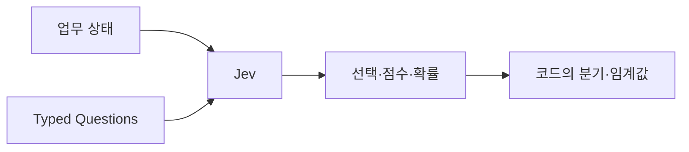
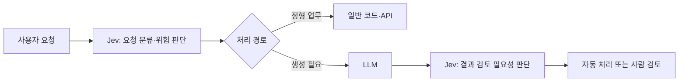

## 대화하지 않는 AI 모델이 등장했다

TypeSafe AI는 2026년 9월 15일 첫 번째 System One Model인 **Jev**를 Early Access로 공개했다. 일반적인 LLM이 다음 토큰을 이어 붙여 문장을 생성한다면, Jev는 미리 정의된 질문에 대해 선택·점수·확률 같은 구조화된 결정을 반환한다.

회사는 이를 다음 한 문장으로 설명한다.

> Unstructured state in, typed probabilistic decisions out.

자연어와 프로그램 상태를 입력하고, 소프트웨어가 바로 사용할 수 있는 타입이 정해진 확률적 결정을 돌려준다는 의미다. [TypeSafe AI의 Jev 공식 발표](https://typesafe.ai/blog/introducing-system-one-models-and-jev)

이 글에서는 Jev의 공개 문서와 회사가 공개한 평가 자료를 기준으로 구조와 활용 범위를 살펴본다. 출시된 지 일주일이 되지 않은 Early Access 기술이므로, 회사의 주장과 외부에서 확인된 사실을 구분할 필요가 있다.

## 1. Jev는 어떤 문제를 해결하려고 할까?

일반적인 LLM은 문자열을 생성한다. 프로그램에서 판단 결과가 필요하면 다음과 같은 과정을 거친다.


Structured Output을 지원하는 모델은 JSON Schema에 맞는 결과를 생성할 수 있다. 그래도 기본적으로는 생성 모델에 구조를 제약하고, 결과를 애플리케이션의 값으로 변환하는 방식이다.

Jev는 출력할 문장 자체를 포기하고 결정 문제에 범위를 맞춘다.



예를 들어 고객 문의를 읽고 답변 문장을 작성하는 것이 아니라 다음을 판단한다.

- 어느 담당 부서로 보낼 것인가?
- 고객의 불만 수준은 어느 정도인가?
- 긴급한 요청인가?
- 자동 처리할 것인가, 사람에게 넘길 것인가?

TypeSafe AI는 Jev를 범용 챗봇보다 코드 안에서 사용하는 지능형 판단 함수에 가깝게 정의한다. [Jev 공식 문서](https://docs.typesafe.ai/introduction)

## 2. Choice·Score·Noul 세 가지 질문

공개된 Jev API는 세 종류의 질문을 제공한다.

| 질문 타입 | 목적 | 반환값 |
|---|---|---|
| Choice | 정해진 후보 중 하나 선택 | 선택값, 후보별 확률, confidence |
| Score | 단계가 있는 기준으로 평가 | 점수, 단계별 확률, confidence |
| Noul | 명제가 얼마나 참인지 판단 | 0에서 1 사이의 값 |

### Choice: 정해진 후보 중 선택

고객 문의를 `billing`, `technical`, `sales` 중 한 부서로 보낼 때 사용할 수 있다. 후보 이름뿐 아니라 각 후보의 의미를 함께 정의한다.

### Score: 단계가 있는 척도로 평가

고객의 불만 수준을 `차분함`, `불만이 있지만 예의 있음`, `매우 화남` 같은 순서가 있는 기준으로 평가할 수 있다.

### Noul: 명제의 참에 가까운 정도

“이 요청은 긴급하다”와 같은 명제를 전달하면 0에서 1 사이의 값을 반환한다. 공식 문서상 Choice와 Score에는 별도 `confidence`가 제공되지만 Noul에는 제공되지 않는다. [TypeSafe AI Confidence 문서](https://docs.typesafe.ai/confidence)

한 번의 요청에 여러 질문을 함께 넣을 수 있으며, 각 질문은 같은 상태를 대상으로 독립적으로 평가된다. TypeSafe AI는 이 질문들을 병렬로 처리하므로 질문 추가가 응답 시간에 미치는 영향이 작다고 설명한다. 이는 회사가 공개한 설계 특성이며 실제 지연은 네트워크와 입력 크기, 서비스 상태를 포함해 직접 측정해야 한다.

## 3. Python SDK로 보는 호출 구조

공식 문서의 고객 문의 예제를 줄이면 다음과 같은 형태다. Python 3.10 이상과 `typesafe-sdk`, API Key가 필요하다.

```python
from typesafe_sdk import Choice, Noul, Score, TypeSafeClient


client = TypeSafeClient()

ticket = "Stripe 연동이 3일째 실패하고 있습니다. 매출 손실이 발생하고 있어요."

response = client.system_one(
    state=ticket,
    questions={
        "department": Choice(
            instructions="어느 팀에서 처리해야 합니까?",
            criteria={
                "billing": "결제 또는 구독 문제",
                "technical": "버그 또는 연동 문제",
                "sales": "가격 또는 계정 문의",
            },
        ),
        "frustration": Score(
            instructions="고객이 얼마나 불만스러워 보입니까?",
            criteria=[
                "차분하게 사실만 설명함",
                "불만이 있지만 예의를 지킴",
                "매우 화가 나고 강한 표현을 사용함",
            ],
        ),
        "is_urgent": Noul(
            instructions="메시지가 긴급성이나 시간 압박을 나타냅니다."
        ),
    },
)

department = response.answers["department"]

if department.confidence < 0.5:
    route_to_human(ticket)
else:
    assign_to_team(ticket, department.choice)
```

실제 결과에는 선택값뿐 아니라 후보별 확률이 포함된다. 애플리케이션은 가장 높은 확률의 후보만 사용할 수도 있고, 두 번째 후보의 확률이 충분히 높다면 양쪽 부서에 함께 전달할 수도 있다. 전체 요청과 응답 형식은 [TypeSafe AI Quick Start](https://docs.typesafe.ai/introduction/quickstart)에서 확인할 수 있다.

이 구조의 중요한 부분은 모델이 업무 전체를 수행하지 않는다는 것이다. 모델은 모호한 판단을 담당하고, 임계값과 실제 실행은 코드가 담당한다.

## 4. LLM Structured Output과 무엇이 다를까?

Jev와 JSON Structured Output은 모두 프로그램이 처리할 수 있는 결과를 만든다. 차이는 최적화의 출발점에 있다.

| 구분 | 일반 LLM + Structured Output | Jev |
|---|---|---|
| 기본 목적 | 텍스트 생성과 다양한 추론 | 정해진 형태의 빠른 판단 |
| 출력 | Schema로 제한된 JSON 등 | Choice·Score·Noul |
| 생성 방식 | 일반적으로 토큰을 순차 생성 | 회사 설명상 결정을 병렬로 출력 |
| 자유도 | 설명, 요약, 추출 등 폭넓음 | 미리 정의한 판단 문제에 집중 |
| 불확실성 | 별도 필드로 요청할 수 있음 | 확률 분포와 confidence를 기본 제공 |
| 활용 위치 | 사용자 답변과 복합 작업 | 라우팅·분류·점수화·검증·분기 |

앞선 [구조화된 출력 글](/posts/structured-output-json-validation/)에서 살펴본 것처럼 일반 LLM도 JSON Schema를 지키도록 만들 수 있다. Jev의 차별점은 단순히 JSON을 깨뜨리지 않는 데 있지 않다. 문자열 생성 비용을 없애고, 타입이 정해진 다수의 판단과 확률을 소프트웨어 Workflow 안에서 빠르게 사용하려는 방향에 있다.

따라서 “JSON이 필요하다”는 이유만으로 Jev가 필요한 것은 아니다. 설명문과 요약도 함께 생성해야 한다면 일반 LLM의 Structured Output이 더 단순할 수 있다. 반대로 같은 판단을 대량·저지연으로 반복한다면 Jev의 설계가 잘 맞을 가능성이 있다.

## 5. 타입이 맞다는 것과 판단이 맞다는 것은 다르다

TypeSafe AI는 Jev가 type error를 만들 수 없으며 hallucination이 없다고 표현한다. 여기서는 두 가지를 분리해서 읽어야 한다.

```text
형식적 안전성: 정의되지 않은 문자열이나 잘못된 타입을 반환하지 않는가?
의미적 정확성: 반환한 선택이나 점수가 실제 정답과 일치하는가?
```

Choice가 `billing`, `technical`, `sales` 중 하나만 반환하도록 보장한다면 `marketing`이라는 존재하지 않는 값을 만들지 않는다는 의미의 타입 안전성을 얻을 수 있다. 하지만 실제로 기술 문제를 `billing`으로 선택할 가능성까지 없어지는 것은 아니다.

“hallucination이 없다”는 표현도 자유 형식 문자열이나 존재하지 않는 선택지를 생성하지 않는다는 범위에서는 이해할 수 있다. 잘못된 판단까지 불가능하다는 뜻으로 받아들이면 안 된다.

공식 문서도 confidence가 낮을 때 사람에게 전달하고, 실행 결과의 위험도에 따라 서로 다른 임계값을 사용하라고 안내한다. 임계값은 모델이 제공한 숫자를 그대로 신뢰해 정하는 것이 아니라 실제 업무 데이터로 보정해야 한다.

## 6. Confidence는 정답 보증서가 아니다

Choice와 Score의 `confidence`는 반환된 확률 분포가 얼마나 한쪽으로 모였는지를 하나의 값으로 요약한 것이다. 후보 하나에 확률이 몰리면 높고, 여러 후보에 퍼지면 낮다.

높은 confidence가 실제로 높은 정확도를 의미하려면 업무 데이터에서 calibration을 확인해야 한다.

예를 들어 confidence가 0.9 이상인 사례 100건 중 실제 정답이 90건 정도인지 측정할 수 있다. 특정 문서 유형, 언어, 조직 용어 또는 입력 길이에서 이 관계가 달라질 수도 있다.

| 실행 위험 | 가능한 처리 예시 |
|---|---|
| 낮음 | 화면 분류나 추천 후보 표시 |
| 중간 | 처리 후 로그 기록과 사후 검토 |
| 높음 | 사람 확인 후 실행 |
| 매우 높음 | 모델 판단을 참고 정보로만 사용 |

잘못된 화면을 보여주는 것과 송금을 승인하는 것은 결과가 다르다. 같은 confidence 임계값을 모든 기능에 사용해서는 안 된다.

## 7. 어디에 잘 맞고, 어디에는 맞지 않을까?

Jev의 공개된 인터페이스를 기준으로 보면 다음 업무가 후보가 될 수 있다.

- 고객 문의와 업무 문서의 분류·라우팅
- Agent가 다음에 사용할 Tool 선택
- 위험도·우선순위·검토 필요성 점수화
- 모델 출력이나 실행 이력의 검증
- 대량 데이터에서 정해진 Feature 추출
- 저지연으로 반복되는 Workflow의 조건 판단

반면 다음 작업은 Jev 단독으로 해결하기 어렵다.

- 사용자에게 전달할 자연어 답변 작성
- 긴 보고서 요약과 문서 생성
- 새로운 코드 작성
- 답변 형식이 미리 정해지지 않은 탐색 작업
- 여러 단계를 계획하고 설명해야 하는 복합 추론

이런 경우에는 일반 LLM이 내용을 생성하고 Jev가 분류·검증·라우팅을 담당하는 조합을 생각할 수 있다.



다만 모델을 하나 더 연결하면 비용뿐 아니라 장애 지점과 평가 대상도 늘어난다. 기존 LLM의 Structured Output과 간단한 규칙으로 충분한지 먼저 비교해야 한다.

## 8. 공식 Benchmark는 어떻게 읽어야 할까?

TypeSafe AI는 공식 발표에서 Jev가 System One 형태의 작업에서 기존 LLM과 비슷한 판단 능력을 보이면서 수십 배에서 수백 배 빠르고 저렴하다고 주장한다. 홈페이지에는 네 가지 Workflow를 평균한 결과로 `193.6x faster`, `444.6x cheaper`라는 수치가 제시돼 있다. [TypeSafe AI 공식 발표](https://typesafe.ai/blog/introducing-system-one-models-and-jev)

숫자만 가져오기 전에 평가 방법을 함께 봐야 한다.

- 평가 대상은 Jev에 맞게 분해된 네 개의 Workflow다.
- 정답은 실제 업무의 Ground Truth가 아니라 대형 모델 두 개의 평균 응답을 기준으로 삼았다.
- Workflow와 질문은 TypeSafe AI 내부 팀이 만들었다.
- 회사는 공개한 개선 폭이 실제 환경에서 높은 쪽일 수 있다고 설명한다.
- 비교 모델은 TypeSafe AI의 Wrapper를 통해 같은 형태의 결정을 반환했다.

공식 평가 페이지는 보안 사고, Agent Trace, Invoice Processing, Customer Service Workflow의 질문과 모델 결과를 공개한다. 재현 가능한 세부 정보를 제공하려는 점은 긍정적이지만, 아직 독립적인 제3자 평가와 다양한 실제 업무 결과가 충분히 축적된 단계는 아니다. [TypeSafe AI Workflow Evals](https://evals.typesafe.ai/)

현재 공개 수치는 “Jev가 모든 LLM보다 193배 빠르다”는 일반적인 결론으로 확대하면 안 된다. **Jev가 목표로 삼은 정형 판단 Workflow에서 회사가 구성한 조건으로 얻은 결과**로 읽는 편이 정확하다.

## 9. 폐쇄망에서는 바로 사용할 수 있을까?

2026년 9월 21일 기준 공식 Quick Start는 다음 TypeSafe-hosted API를 호출하는 방식을 안내한다.

```text
POST https://api.typesafe.ai/v1/systemone
```

공식 고객 계약도 Web Interface와 TypeSafe-hosted API를 서비스로 설명한다. 현재 공개 문서에서는 Jev의 가중치 다운로드나 자체 호스팅·온프레미스 배포 방법을 확인할 수 없다. [TypeSafe AI 서비스 계약](https://typesafe.ai/legal/mca)

따라서 외부 통신이 차단된 폐쇄망에서 바로 사용할 수 있다고 가정하면 안 된다. 민감한 업무 데이터를 보내려면 데이터 처리 조건, 보관 위치, 로그 정책, 네트워크 연결, 별도 기업용 배포 제공 여부를 공급사에 확인해야 한다.

이 부분은 제품이 막 공개된 Early Access 단계이므로 이후 바뀔 수 있다. 실제 도입 시점에는 최신 문서와 계약 조건을 다시 확인해야 한다.

## 10. 직접 평가한다면 무엇을 측정할까?

관심 있는 업무 하나를 선택해 기존 방식과 나란히 비교하는 것이 좋다.

| 평가 항목 | 확인할 내용 |
|---|---|
| 판단 정확도 | Choice·Score·Noul 결과가 업무 정답과 맞는가 |
| Calibration | 확률과 confidence 구간별 실제 정확도가 일치하는가 |
| 미포함 사례 | `other`나 사람 검토가 필요한 입력을 잘 구분하는가 |
| 지연 | 평균뿐 아니라 p95 응답 시간이 어떤가 |
| 비용 | 같은 업무 건수를 처리할 때 실제 청구 비용이 얼마인가 |
| 일관성 | 같은 의미의 입력 표현이 달라져도 판단이 유지되는가 |
| 장애 처리 | 타임아웃·API 오류·낮은 confidence를 어떻게 처리하는가 |

비교 대상은 Jev, 일반 LLM의 Structured Output, 기존 분류 모델, 규칙 기반 코드가 될 수 있다. 각 방식에 같은 입력과 같은 업무 성공 기준을 적용해야 한다.

특히 confidence 임계값을 테스트 데이터에 맞춰 고정한 뒤 별도 평가 데이터에서 자동 처리율과 오류율을 확인한다. 테스트 결과를 보고 계속 임계값을 조정하면 실제 운영 성능을 과대평가할 수 있다.

## 흥미로운 방향이지만 아직은 검증할 기술이다

Jev의 가장 설득력 있는 부분은 AI가 모든 내용을 문장으로 생성할 필요가 없다는 문제 제기다. 소프트웨어가 필요한 것이 정해진 후보 중 선택과 확률이라면, 범용 텍스트 생성은 지나치게 자유롭고 비쌀 수 있다.

Choice·Score·Noul을 코드의 조건과 조합하는 구조는 [Workflow와 Agent 글](/posts/workflow-and-agent/)에서 살펴본 “모델이 판단할 부분과 코드가 보장할 절차를 나누는 방식”과도 잘 맞는다.

다만 타입 안전성은 판단 정확성을 대신하지 않는다. Jev의 속도와 비용, calibration이 실제 업무에서도 유지되는지는 자체 평가가 필요하며, Early Access와 호스팅 형태의 제약도 확인해야 한다.

현재 Jev는 기존 LLM을 모두 대체할 모델이라기보다, **LLM이 담당하던 분류·점수화·라우팅을 별도의 빠른 decision model로 분리하려는 새로운 선택지**로 보는 것이 가장 적절하다.
