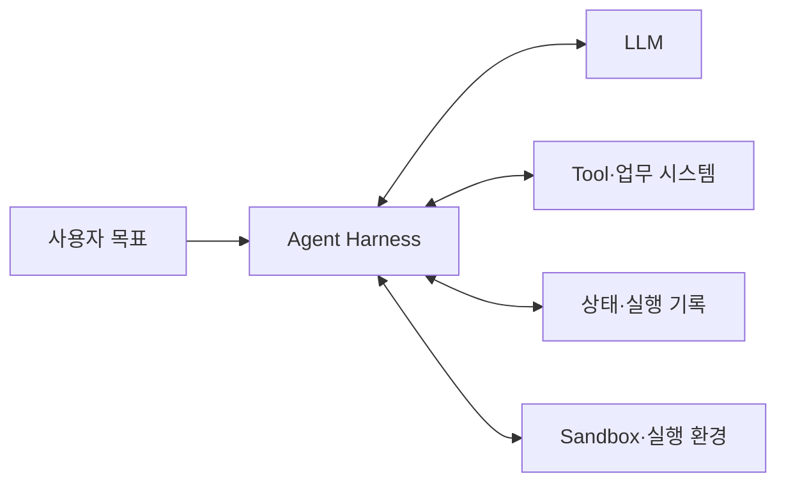
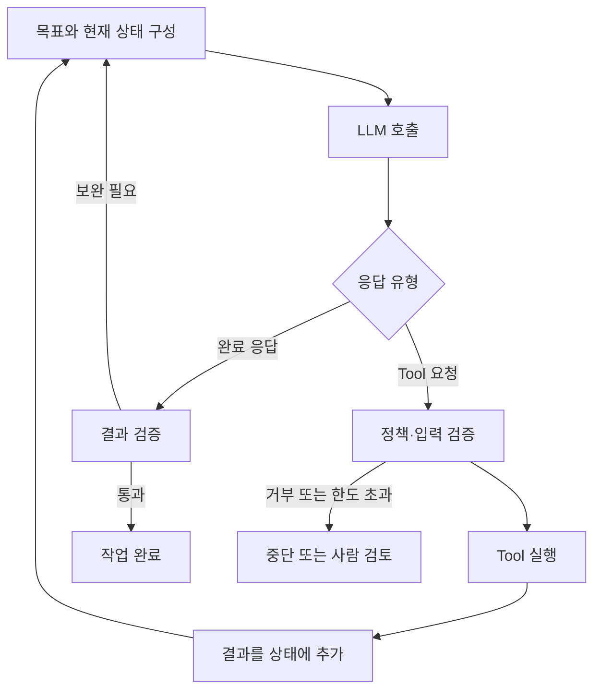
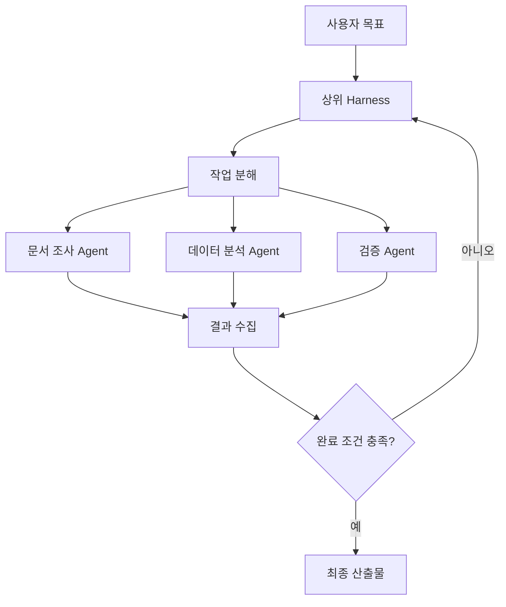
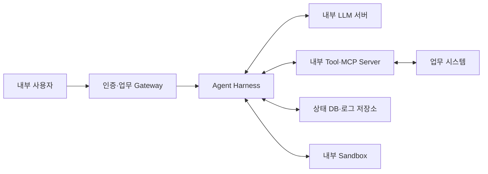

## 같은 모델인데 왜 Agent의 능력은 다를까?

같은 LLM을 사용해도 어떤 Agent는 짧은 질문에 답하는 데 그치고, 다른 Agent는 저장소를 분석하고 파일을 수정한 뒤 테스트까지 실행한다. 차이는 모델 성능만으로 설명되지 않는다.

모델은 기본적으로 입력을 받아 다음 응답을 생성한다. 모델이 여러 단계에 걸쳐 작업하려면 다음 기능을 제공하는 프로그램이 필요하다.

- 현재 목표와 진행 상태를 모델에 전달한다.
- 모델이 요청한 Tool을 실제로 실행한다.
- 실행 결과를 다음 모델 호출에 반영한다.
- 허용되지 않은 행동을 차단하거나 사람의 승인을 받는다.
- Context가 길어지면 필요한 정보를 보존하고 정리한다.
- 오류나 중단이 발생해도 작업을 이어갈 수 있게 상태를 저장한다.

이처럼 **모델 호출과 실행 환경 사이에서 Agent의 작업을 운영하는 계층**을 Agent Harness라고 부를 수 있다.

2026년 4월 Anthropic은 Managed Agents의 구성 요소를 Session, Harness, Sandbox로 나누면서 Harness를 모델 호출과 Tool 요청을 실행 인프라에 연결하는 Loop로 설명했다. OpenAI도 Agents SDK와 Agents API에서 Context 관리, Tool 사용, Sandbox, 장기 실행과 Subagent 조율을 Harness의 주요 기능으로 다룬다. 제품마다 범위는 다르지만 공통점은 모델 바깥에서 실행을 통제한다는 것이다. [Anthropic Managed Agents](https://www.anthropic.com/engineering/managed-agents), [OpenAI Agents API](https://openai.com/index/introducing-the-agents-api/)

## 1. 모델과 Harness의 역할 구분

Agent를 하나의 거대한 AI 프로그램으로 보면 문제가 생겼을 때 어느 부분을 확인해야 하는지 알기 어렵다. 먼저 역할을 나눠보자.



| 구성 요소 | 담당하는 역할 |
|---|---|
| LLM | 현재 Context를 해석하고 답변이나 다음 행동을 생성 |
| Harness | Context 구성, Tool 연결, 반복 실행, 상태와 정책 관리 |
| Tool | 검색, 데이터 조회, 파일 수정, API 호출처럼 외부 환경에 영향을 주는 기능 |
| Sandbox | 코드와 명령을 제한된 권한으로 실행하는 격리 환경 |
| 상태 저장소 | 메시지, Tool 결과, Checkpoint, 산출물 위치와 실행 상태 보존 |

예를 들어 모델이 `search_documents(query="출장비 규정")`라는 Tool Call을 생성해도 문서 검색이 바로 일어나지는 않는다. Harness가 다음을 확인하고 실행해야 한다.

1. `search_documents`가 등록된 Tool인가?
2. 입력값이 Tool Schema에 맞는가?
3. 현재 사용자에게 이 문서를 검색할 권한이 있는가?
4. 호출 횟수와 실행 시간이 제한을 넘지 않았는가?
5. 검색 결과 중 어느 범위까지 모델에게 전달할 것인가?

모델은 행동을 제안하고, Harness는 그 행동을 실행 가능한 작업으로 바꾼다.

## 2. 가장 작은 Agent Harness는 반복문이다

Agent의 핵심 동작은 생각보다 단순하다. Anthropic은 Agent를 환경의 피드백을 이용해 Tool을 사용하는 LLM Loop로 설명한다. 작업 완료나 최대 반복 횟수 같은 종료 조건은 시스템에서 함께 적용한다. [Building effective agents](https://www.anthropic.com/engineering/building-effective-agents)



개념만 나타내면 다음과 같은 형태다.

```python
state = create_initial_state(user_request)

for step in range(MAX_STEPS):
    context = build_context(state)
    response = model.generate(context, tools=allowed_tools(state))

    if response.is_final:
        return validate_final_answer(response, state)

    tool_call = validate_tool_call(response.tool_call, state)
    tool_result = execute_tool(tool_call)
    state.append(tool_call, tool_result)

return request_human_review(state)
```

이 코드는 Agent Loop의 모양만 보여준다. 운영 환경에서는 Timeout, 재시도, 권한, 상태 저장, 중복 실행 방지, 로그와 Context 제한을 함께 처리해야 한다. Harness의 차이는 이 반복문 주변을 얼마나 안정적으로 구성하는지에서 나타난다.

## 3. Context를 구성하는 방식이 Agent의 판단을 바꾼다

모델은 Harness가 전달한 Context 밖의 상태를 직접 알 수 없다. 따라서 어떤 정보를 어떤 순서로 넣는지가 Agent의 행동에 영향을 준다.

Harness가 구성하는 Context에는 보통 다음 내용이 포함된다.

- 시스템 지침과 업무 규칙
- 사용자의 목표와 추가 요청
- 사용할 수 있는 Tool의 이름과 설명
- 이전 Tool Call과 실행 결과
- 현재까지 만든 파일이나 중간 산출물의 위치
- 남은 실행 시간, 단계 수와 미해결 항목
- 검색한 문서나 장기 Memory에서 가져온 정보

모든 기록을 계속 추가하면 Context Window가 가득 차고 비용도 늘어난다. 반대로 너무 많이 요약하면 이미 확인한 사실이나 중요한 제약이 사라질 수 있다.

장시간 실행을 지원하는 Harness는 일반적으로 다음 방법을 조합한다.

| 방법 | 목적 | 주의할 점 |
|---|---|---|
| 최근 기록 유지 | 바로 앞 단계의 흐름 보존 | 오래된 결정이 밀려날 수 있음 |
| 대화와 실행 기록 요약 | Context 크기 절감 | 숫자·경로·예외 조건이 손실될 수 있음 |
| 상태를 별도 구조로 저장 | 완료 항목과 미해결 항목을 명시적으로 보존 | 상태 Schema와 갱신 규칙이 필요 |
| 필요할 때 검색 | 과거 기록과 문서를 선택적으로 불러옴 | 검색 실패와 잘못된 검색 결과를 평가해야 함 |
| 산출물을 파일로 저장 | 큰 결과를 Context 밖에 보관 | 파일 위치와 최신 버전을 추적해야 함 |

OpenAI는 장시간 Session에서 Context 한계에 가까워지면 이전 내용을 압축하고 필요한 정보를 이어가는 기능을 Agents API의 Harness 기능으로 설명한다. 중요한 점은 Context 압축이 단순한 대화 요약이 아니라 **다음 행동에 필요한 상태를 보존하는 작업**이라는 것이다. [OpenAI Agents API](https://openai.com/index/introducing-the-agents-api/)

## 4. Tool이 많다고 좋은 Harness는 아니다

Tool이 늘어나면 Agent가 할 수 있는 일도 많아지지만 선택지는 복잡해진다. 비슷한 Tool이 여러 개 있거나 설명이 모호하면 모델이 잘못된 Tool을 고를 가능성이 커진다.

Harness는 Tool을 모델에 보여주는 과정부터 관리할 수 있다.

1. 현재 작업과 사용자 권한에 맞는 Tool만 선택한다.
2. 이름, 설명, 입력 Schema를 모델이 구분하기 쉽게 제공한다.
3. Tool Call의 인자를 실행 전에 검증한다.
4. 큰 Tool 결과는 필요한 부분만 정리해 Context에 넣는다.
5. 결과가 실패인지 성공인지 명확한 형식으로 전달한다.

Tool이 수백 개라면 전체 정의를 매번 Context에 넣는 비용도 무시하기 어렵다. 이 경우 먼저 관련 Tool을 검색한 뒤 필요한 정의만 불러오는 방식이나, 코드에서 여러 Tool 결과를 합친 뒤 모델에는 요약된 결과만 전달하는 방식을 고려할 수 있다.

MCP는 Harness와 Tool 제공자 사이의 연결을 표준화할 수 있지만, 어떤 Tool을 노출하고 누가 호출할 수 있는지는 여전히 Harness의 정책이다. [Tool Calling과 MCP 글](/posts/tool-calling-and-mcp/)에서 살펴본 것처럼 연결 규약과 실행 통제는 서로 다른 문제다.

## 5. 실행 상태와 대화 기록은 다르다

Agent가 “문서 세 개 중 두 개를 검토했다”고 말한 것만으로 실제 진행 상태를 판단해서는 안 된다. 실행 상태는 프로그램이 확인할 수 있는 값으로 관리해야 한다.

예를 들어 여러 문서를 분석하는 작업이라면 다음 상태를 별도로 저장할 수 있다.

```json
{
  "run_id": "run-20260922-001",
  "status": "running",
  "completed_documents": ["DOC-001", "DOC-002"],
  "pending_documents": ["DOC-003"],
  "failed_documents": [],
  "step_count": 7,
  "artifact_path": "/outputs/report.md"
}
```

이 상태는 다음 용도로 사용된다.

- 중단된 작업을 마지막 Checkpoint부터 다시 시작한다.
- 이미 완료된 문서를 중복 처리하지 않는다.
- 사용자 화면에 실제 진행률을 보여준다.
- 최대 단계 수와 실행 시간을 적용한다.
- 실패한 Tool Call만 선택적으로 재시도한다.

대화 기록은 모델에게 작업의 맥락을 전달하고, 실행 상태는 시스템이 작업의 사실을 관리한다. 둘을 같은 문자열로만 저장하면 복구와 검증이 어려워진다.

## 6. 재시도보다 먼저 중복 실행을 생각해야 한다

네트워크 Timeout이 발생했다고 Tool이 실행되지 않은 것은 아니다. 응답을 받기 전에 연결만 끊겼을 수도 있다.

조회 요청은 다시 실행해도 결과가 같을 가능성이 높지만, 다음 작업은 단순 재시도가 위험하다.

- 결제 승인
- 문서 등록
- 메일 발송
- 사용자 권한 변경
- 배포 실행

Harness가 실패한 Tool을 무조건 다시 호출하면 같은 작업이 두 번 실행될 수 있다. 변경 작업에는 요청을 구분하는 Idempotency Key를 사용하거나, 실행 전후 상태를 조회해 완료 여부를 확인하는 방식이 필요하다.

재시도 정책도 오류 종류에 따라 달라져야 한다.

| 오류 | 가능한 처리 |
|---|---|
| 일시적인 연결 실패 | 제한된 횟수로 지수 Backoff 재시도 |
| 입력 Schema 오류 | 재시도하지 않고 모델 또는 코드에서 입력 수정 |
| 권한 부족 | 즉시 중단하고 필요한 권한을 안내 |
| 업무 규칙 위반 | 사람 검토 또는 정해진 예외 Workflow로 전환 |
| 결과 상태 불명확 | 대상 시스템에서 처리 여부를 먼저 조회 |

모델에게 “다시 시도해”라고 맡기는 것과 시스템이 안전한 재시도 규칙을 적용하는 것은 다르다.

## 7. Sandbox는 Harness와 같은 것이 아니다

Harness는 Agent Loop를 운영하고, Sandbox는 Tool과 코드가 실행되는 범위를 제한한다.

예를 들어 코드 실행 Agent라면 Sandbox에 다음 제약을 둘 수 있다.

- 작업용 디렉터리만 읽고 쓸 수 있다.
- 허용한 명령과 실행 시간만 사용한다.
- 외부 네트워크 접근을 차단하거나 목적지를 제한한다.
- Credential을 모델의 Context와 실행 환경에서 분리한다.
- CPU, GPU, Memory와 저장 공간의 상한을 둔다.
- 작업이 끝나면 임시 환경을 폐기한다.

OpenAI Agents SDK는 Harness와 실행 환경을 분리하면 Credential을 모델이 생성한 코드로부터 떨어뜨리고, Sandbox가 사라져도 외부에 저장한 상태로 작업을 복구할 수 있다고 설명한다. [The next evolution of the Agents SDK](https://openai.com/index/the-next-evolution-of-the-agents-sdk/)

Sandbox가 있다고 모든 행동이 안전해지는 것은 아니다. 내부 API 호출처럼 Sandbox 밖의 시스템에 영향을 주는 Tool은 별도의 인증과 권한 검사를 거쳐야 한다.

## 8. 사람의 승인은 어느 위치에 넣을까?

Human-in-the-loop는 모든 Tool Call을 사람이 확인하는 기능이 아니다. 위험도와 복구 가능성에 따라 승인 지점을 선택한다.

| 행동 | 처리 예시 |
|---|---|
| 문서 검색과 읽기 | 권한 범위 안에서 자동 실행 |
| 임시 파일 생성 | Sandbox 안에서 자동 실행 |
| 외부 메일 초안 작성 | 자동 작성 후 내용 검토 |
| 메일 발송 | 발송 직전 승인 |
| 운영 데이터 변경 | 변경 내용과 영향 범위를 보여준 뒤 승인 |
| 복구하기 어려운 작업 | Agent의 직접 실행 대상에서 제외 |

승인 요청에는 “진행할까요?”라는 문장만 보여주기보다 다음 정보를 함께 제공하는 것이 좋다.

- 어떤 Tool을 실행하는가?
- 어느 시스템과 데이터를 변경하는가?
- 입력값과 예상 영향은 무엇인가?
- 실패하거나 잘못 실행됐을 때 되돌릴 수 있는가?

승인은 Harness가 Tool 실행 직전에 중단하고, 사용자의 결정 이후 같은 실행 상태에서 이어갈 수 있어야 한다.

## 9. 관찰 가능성이 있어야 Agent를 개선할 수 있다

최종 답변만 저장하면 Agent가 왜 느렸는지, 어느 Tool에서 실패했는지 확인하기 어렵다. 그렇다고 모델의 숨겨진 사고 과정을 수집할 필요는 없다. 시스템에서 관찰 가능한 사건을 기록하면 된다.

| 기록할 항목 | 확인할 수 있는 문제 |
|---|---|
| 모델 호출 시간과 사용량 | 느린 단계와 비용 증가 |
| Tool 이름, 입력과 결과 상태 | 잘못된 Tool 선택과 반복 호출 |
| 정책의 허용·거부 결과 | 권한 설정과 승인 흐름 오류 |
| Checkpoint와 상태 변경 | 중단 이후 복구 실패 |
| 최종 검증 결과 | 완료 선언과 실제 성공의 차이 |
| 오류 유형과 재시도 횟수 | 반복되는 장애와 불필요한 재시도 |

민감한 원문과 Credential은 로그에 그대로 남기지 않는다. 문서 ID, 결과 건수, Hash, 상태 코드처럼 문제를 추적하는 데 필요한 최소 정보로 기록할 수 있다.

평가할 때는 최종 답변 정확도 외에도 다음 지표를 함께 본다.

- 목표를 실제로 완료한 비율
- 올바른 Tool과 인자를 사용한 비율
- 불필요한 Tool Call 수
- 작업당 모델 호출 수와 비용
- 평균 및 p95 완료 시간
- 중단 후 복구 성공률
- 승인 없이 위험한 행동을 시도한 비율
- 같은 입력을 반복했을 때의 성공 일관성

## 10. Multi-Agent도 Harness가 조율한다

Subagent를 여러 개 실행하면 각 Agent가 자동으로 협력하는 것은 아니다. 상위 Harness가 작업 분해, Context 전달, 결과 수집과 종료를 관리해야 한다.



Harness가 정해야 할 항목은 다음과 같다.

- 어떤 작업을 독립적으로 나눌 수 있는가?
- 각 Subagent에 어떤 Context와 Tool을 제공할 것인가?
- 동시에 실행할 Agent 수를 얼마나 제한할 것인가?
- 서로 충돌하는 결과를 어떻게 검증할 것인가?
- 한 Agent가 실패했을 때 전체 작업을 중단할 것인가?

독립적인 조사가 많다면 병렬 실행으로 시간을 줄일 수 있다. 반면 같은 파일이나 데이터를 동시에 변경하면 충돌 처리 비용이 커질 수 있다. Multi-Agent는 Agent 수를 늘리는 기능보다 **독립적인 작업 경계를 설계하는 문제**에 가깝다.

## 11. 폐쇄망에서는 Harness가 연결의 중심이 된다

폐쇄망 Agent에서도 Harness의 역할은 같다. 차이는 모델, Tool, Package와 실행 환경을 내부에서 제공해야 한다는 점이다.



구성할 때 다음 항목을 확인한다.

1. **모델 연결**: 내부 추론 서버의 API와 동시 처리 한도를 Harness가 관리하는가?
2. **Tool 배포**: Tool과 MCP Server의 Package를 내부 저장소에서 설치할 수 있는가?
3. **인증 전달**: 사용자의 업무 권한을 Tool 호출까지 안전하게 전달하는가?
4. **실행 격리**: 모델이 생성한 코드가 업무 서버와 같은 권한으로 실행되지 않는가?
5. **상태 보존**: 장시간 작업의 Checkpoint와 산출물이 내부 저장소에 남는가?
6. **감사 기록**: 어떤 사용자의 요청으로 어떤 Tool이 실행됐는지 확인할 수 있는가?
7. **외부 의존성**: Telemetry, License 확인, CDN과 외부 API 호출이 차단돼도 동작하는가?

내부 LLM을 실행했다고 Agent 구축이 끝나는 것은 아니다. 모델이 업무 시스템에 접근하는 경로와 권한을 Harness에서 통제해야 운영 가능한 Agent가 된다.

## 12. 직접 만들 것과 가져다 쓸 것을 나누기

Harness 전체를 처음부터 만들 필요는 없다. 반대로 Framework나 관리형 API를 도입했다고 업무 정책까지 해결되는 것도 아니다.

| 공통 기능으로 가져오기 좋은 부분 | 업무에 맞게 직접 정의할 부분 |
|---|---|
| 모델 API 호출과 Streaming | 업무별 시스템 지침 |
| Tool Call Parsing과 Schema 검증 | 사용자와 데이터 접근 권한 |
| 기본 실행 Loop와 Checkpoint | 성공·실패 판정 기준 |
| Trace와 사용량 수집 | 승인 대상과 위험도 구분 |
| Sandbox 연결 | 업무 오류와 복구 정책 |
| Context 압축과 상태 복원 | 보존해야 할 핵심 업무 상태 |

관리형 Harness는 장시간 실행과 Sandbox 운영 부담을 줄일 수 있지만, 데이터가 어디에서 처리되는지와 폐쇄망 지원 여부를 확인해야 한다. 자체 구축은 실행 위치와 정책을 세밀하게 통제할 수 있지만, 모델과 Tool 규격이 바뀔 때 유지보수해야 한다.

선택할 때는 기능 목록보다 다음 질문이 중요하다.

- 실행 중인 상태와 Tool Call을 충분히 확인할 수 있는가?
- 특정 모델이나 Tool 제공 방식에 과도하게 묶이지 않는가?
- 작업 중단 후 복구와 중복 실행 방지가 가능한가?
- 권한과 승인 정책을 코드로 강제할 수 있는가?
- 실제 업무 평가 결과를 수집하기 쉬운가?

## 모델보다 실행 구조를 함께 평가하기

Agent Harness는 LLM을 더 똑똑하게 만드는 모델이 아니다. **모델이 어떤 정보를 보고, 어떤 Tool을 사용할 수 있으며, 실행 결과를 어떻게 이어가고 멈출지를 관리하는 프로그램**이다.

같은 모델도 Harness가 Context를 잘못 구성하면 이미 확인한 내용을 잊고, Tool 결과를 지나치게 많이 넣으면 중요한 정보를 놓칠 수 있다. 재시도와 권한 정책이 약하면 정답을 생성하고도 실제 실행에서 사고가 날 수 있다.

Agent를 평가할 때 모델 이름과 Prompt만 비교해서는 부족하다. Context 관리, Tool 설계, 상태 저장, 권한, Sandbox, 복구와 관찰 가능성을 함께 봐야 한다. 모델이 Agent의 판단을 담당한다면 Harness는 그 판단이 실제 시스템 안에서 안전하고 지속적인 작업이 되도록 만드는 실행 기반이다.
