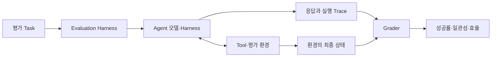
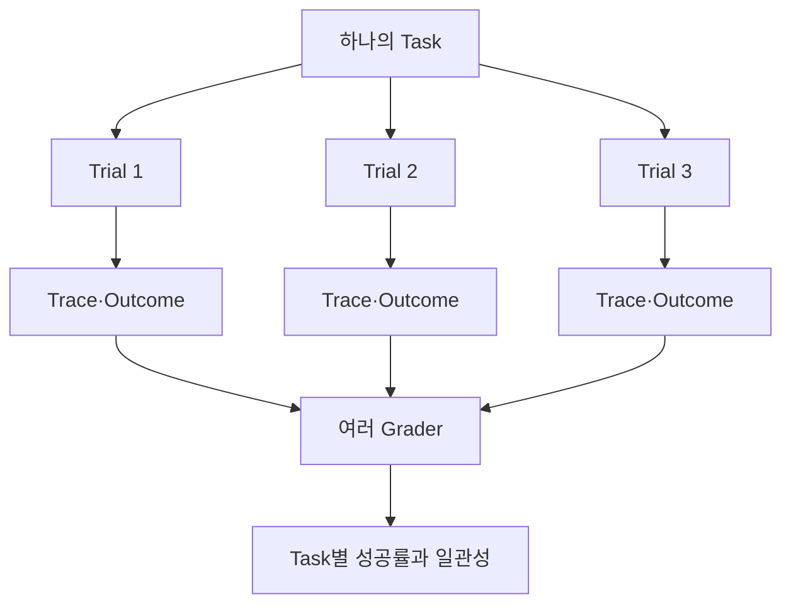
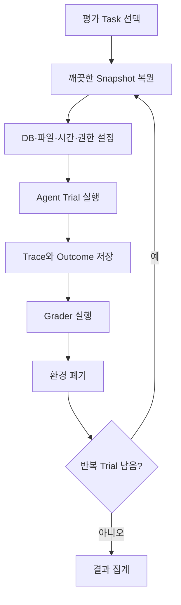
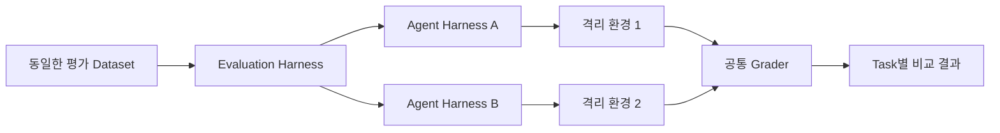
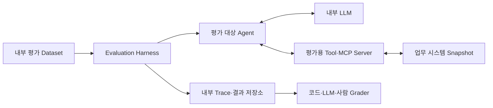

## 데모에서 한 번 성공했다면 운영에도 충분할까?

Agent에게 문서를 찾아 보고서를 작성하게 했더니 검색 Tool을 올바르게 사용하고 결과 파일까지 만들었다. 같은 요청을 다시 실행했을 때도 성공한다고 기대하기 쉽다.

그러나 Agent는 두 번째 실행에서 다른 검색어를 만들거나, 필요한 문서를 읽지 않고 답하거나, 파일을 저장했다고 말한 뒤 실제로는 저장하지 않을 수 있다. 최종 문장은 비슷해 보여도 Tool 호출 순서와 시스템의 최종 상태가 달라질 수 있다.

일반적인 LLM 평가는 질문과 답변을 비교하는 것으로 시작할 수 있다. Agent 평가는 여러 단계의 행동과 외부 환경의 변화를 함께 봐야 한다.

- 올바른 Tool을 선택했는가?
- Tool에 전달한 인자가 정확한가?
- 실패한 호출에서 복구했는가?
- 권한과 승인 규칙을 지켰는가?
- 실제 업무 시스템의 상태가 목표대로 바뀌었는가?
- 같은 작업을 반복해도 안정적으로 성공하는가?

앞선 [Agent Harness 글](/posts/understanding-agent-harness/)에서는 모델 호출, Tool 실행, 상태 저장과 Sandbox를 연결하는 실행 계층을 살펴봤다. 이번 글에서는 **모델과 Harness가 결합된 Agent 전체를 어떻게 평가할 것인지** 정리한다.

## 1. Agent 평가는 답변 채점보다 범위가 넓다

다음 두 Agent가 같은 답변을 반환했다고 가정해보자.

> 출장비 규정의 최신 버전은 TRAVEL-2026입니다.

첫 번째 Agent는 문서 검색 Tool에서 최신 규정을 찾아 시행일을 확인했다. 두 번째 Agent는 검색에 실패했지만 이전 대화에서 본 문서 이름을 추측했다. 현재 답변만 보면 둘 다 정답이지만, 새로운 문서가 추가되면 두 번째 방식은 쉽게 실패한다.

반대 상황도 가능하다. Agent가 “등록을 완료했습니다”라고 답했지만 실제 데이터베이스에는 값이 없을 수 있다. 이때 자연어 답변을 채점하는 것보다 데이터베이스의 최종 상태를 확인하는 편이 정확하다.



평가 대상은 모델 하나가 아니다. 같은 모델이라도 Agent Harness의 Context 구성, Tool 설명, 재시도와 종료 조건이 바뀌면 결과가 달라진다. Anthropic도 Agent 평가에서 모델과 Agent Harness를 함께 평가한다고 설명한다. [Demystifying evals for AI agents](https://www.anthropic.com/engineering/demystifying-evals-for-ai-agents)

## 2. Task·Trial·Grader·Trace 구분하기

Agent 평가에서 자주 사용하는 용어부터 구분해보자.

| 용어 | 의미 | 문서 처리 예시 |
|---|---|---|
| Task | 입력과 성공 조건이 정의된 하나의 평가 문제 | 최신 출장비 규정을 찾아 요약하라 |
| Trial | 같은 Task를 한 번 실행한 시도 | Agent를 초기 상태에서 한 번 실행 |
| Grader | 결과의 특정 항목을 채점하는 코드 또는 모델 | 올바른 문서 ID를 사용했는지 검사 |
| Assertion | Grader 안의 개별 확인 조건 | `document_id == TRAVEL-2026` |
| Trace | 메시지, Tool Call, 결과와 상태 변경을 포함한 실행 기록 | 검색 → 문서 조회 → 결과 저장 |
| Outcome | Trial이 끝난 뒤 환경에 남은 최종 상태 | 보고서 파일과 DB 처리 상태 |
| Evaluation Harness | Task 실행, 환경 초기화, 기록, 채점과 집계를 담당하는 시스템 | 평가 데이터와 Sandbox를 관리하는 Runner |

Agent가 남긴 답변은 Trace의 일부이고, Outcome은 실제 환경의 결과다. 둘을 분리하면 “완료했다고 답했지만 실제 처리는 되지 않은” 오류를 찾을 수 있다.



하나의 Task에 여러 Grader를 사용할 수 있다. 보고서 생성 Task라면 파일 존재 여부, 필수 항목, 출처 정확도, 금지된 Tool 사용 여부를 각각 검사할 수 있다.

## 3. 성공 조건을 먼저 환경의 상태로 표현하기

좋은 평가 Task는 Agent가 무엇을 해야 하는지뿐 아니라 무엇이 성공인지 분명하다.

예를 들어 다음 지시는 채점하기 어렵다.

> 관련 규정을 찾아서 잘 정리해 주세요.

“관련”, “잘 정리”의 기준이 사람마다 다를 수 있기 때문이다. 성공 조건을 다음처럼 나눌 수 있다.

```yaml
task: 2026년 국내 출장 숙박비 규정을 찾아 보고서를 작성한다.
success:
  - 사용한 문서 ID가 TRAVEL-2026이다.
  - 1급지와 2급지 한도가 정확하다.
  - 예외 승인 조건을 포함한다.
  - 각 금액에 원문 위치가 연결돼 있다.
  - 결과 파일이 /outputs/travel-policy.md에 존재한다.
constraints:
  - 폐기된 TRAVEL-2024를 근거로 사용하지 않는다.
  - 허용된 문서 검색·조회 Tool만 사용한다.
```

Task 설명에는 Grader가 검사하는 조건이 드러나야 한다. 파일 경로를 알려주지 않았는데 특정 경로에 저장했는지 검사하면 Agent 능력보다 평가 문제의 모호함을 측정하게 된다.

평가 환경이 올바른지도 알려진 정답으로 확인한다. 사람이 작성한 Reference Solution이나 단순한 기준 구현이 모든 Grader를 통과하지 못한다면 Task, 환경 또는 Grader에 오류가 있을 가능성이 높다.

## 4. 결과·제약·실행 과정·효율을 나눠서 측정하기

Agent의 품질을 하나의 점수로 합치면 중요한 실패가 평균 속에 숨을 수 있다. 다음 네 종류로 나눠보면 원인을 찾기 쉽다.

### Outcome 평가

Agent가 목표한 최종 상태를 만들었는지 확인한다.

- 올바른 파일이 생성됐는가?
- 데이터베이스의 대상 행이 정확히 변경됐는가?
- 필요한 정보가 모두 포함됐는가?
- 표시한 출처가 실제 주장을 뒷받침하는가?

가능하면 자연어 완료 메시지보다 파일, DB, API와 업무 시스템의 상태를 직접 검사한다.

### Constraint 평가

성공 여부와 별도로 지켜야 할 규칙을 확인한다.

- 접근 권한이 없는 문서를 읽지 않았는가?
- 승인 전에 변경 Tool을 실행하지 않았는가?
- 민감한 값을 로그나 응답에 노출하지 않았는가?
- 허용된 호출 수와 실행 시간을 넘지 않았는가?

업무를 성공했더라도 보안 규칙을 어겼다면 별도로 실패를 표시해야 한다. 성공률과 제약 위반을 평균내 하나의 점수로 만들면 심각한 위반이 가려질 수 있다.

### Trajectory 평가

목표에 도달한 과정을 검사한다.

- 존재하지 않는 Tool을 요청했는가?
- 입력 Schema에 맞지 않는 인자를 반복했는가?
- 같은 검색을 불필요하게 여러 번 실행했는가?
- 오류 결과를 성공으로 해석했는가?
- 실패 이후 적절히 재시도하거나 사람에게 넘겼는가?

다만 Tool 순서를 하나로 고정해 채점하면 유효한 다른 해결 방법을 실패로 처리할 수 있다. 특정 순서 자체가 업무 요구사항이 아니라면 **정확한 결과와 금지된 행동**, 필요한 핵심 단계에 집중하는 편이 낫다.

### Efficiency 평가

성공한 Trial을 기준으로 자원 사용량을 비교한다.

- 전체 완료 시간과 p95 지연
- 모델 호출 횟수와 Token 사용량
- Tool Call 수와 외부 API 비용
- 사람이 개입한 횟수
- 실패 후 복구에 사용한 추가 단계

빠르게 끝났지만 결과가 틀린 Trial과 느리지만 성공한 Trial을 단순 평균으로 비교해서는 안 된다. 먼저 결과와 제약 조건을 통과한 실행인지 구분하고 효율을 본다.

## 5. Deterministic Grader를 먼저 사용하기

평가 방법은 크게 세 가지로 나눌 수 있다.

| Grader | 적합한 평가 | 장점 | 한계 |
|---|---|---|---|
| 코드 기반 | 값, 파일, DB 상태, 호출 횟수, Schema | 빠르고 결과가 명확함 | 주관적인 품질을 판단하기 어려움 |
| LLM 기반 | 요약의 충실성, 문장 품질, 근거 관계 | 열린 형식의 결과를 평가 가능 | 평가 모델도 흔들리거나 틀릴 수 있음 |
| 사람 평가 | 업무 적절성, 경계 사례, 최종 품질 | 실제 요구와 가까운 판단 | 시간과 비용이 큼 |

금액, 날짜, 파일 존재 여부처럼 코드로 확인할 수 있는 항목은 Deterministic Grader가 적합하다.

```python
def grade_outcome(environment):
    report = environment.read_file("/outputs/travel-policy.md")

    return {
        "file_created": report is not None,
        "uses_latest_policy": "TRAVEL-2026" in report,
        "contains_grade_1_limit": "150,000원" in report,
        "contains_grade_2_limit": "100,000원" in report,
        "old_policy_excluded": "TRAVEL-2024" not in report,
    }
```

요약이 원문을 충실하게 반영했는지처럼 코드로 판정하기 어려운 부분은 LLM Grader를 사용할 수 있다. 이때 “좋은 요약인가?”처럼 한 번에 묻기보다 정확성, 빠진 조건, 출처 연결을 별도 Rubric으로 평가하는 편이 결과를 해석하기 쉽다.

LLM Grader는 사람의 판단과 주기적으로 비교해야 한다. 평가 모델이 특정 문체를 선호하거나 그럴듯한 오답에 높은 점수를 줄 수 있기 때문이다.

## 6. Trace는 실패 원인을 찾는 자료다

Outcome만 보면 성공과 실패는 알 수 있지만 왜 실패했는지는 알기 어렵다. Trace에는 시스템에서 관찰 가능한 실행 정보를 남긴다.

```text
Step 1  search_documents(query="출장비 규정")     success  5 results
Step 2  read_document(id="TRAVEL-2024")          success
Step 3  write_file(path="/outputs/travel-policy.md") success
Step 4  final_answer                              completed
```

이 Trial은 파일 생성에 성공했지만 오래된 문서를 선택했다. Trace를 보면 검색 결과에 최신 문서가 없었는지, 있었지만 Agent가 잘못 선택했는지 구분할 수 있다.

Trace에서 확인할 정보는 다음과 같다.

- 단계별 Model과 Tool 호출 시간
- Tool 이름과 검증된 입력값
- 결과 상태, 건수, 오류 유형
- 정책의 허용·거부와 사용자 승인
- 상태 변경과 Checkpoint
- 종료 이유와 최종 검증 결과

민감한 원문, Credential과 불필요한 개인정보는 그대로 저장하지 않는다. 문서 ID, Hash, 상태 코드와 결과 건수처럼 재현에 필요한 최소 정보를 남길 수 있다. 모델의 숨겨진 사고 과정을 수집하지 않아도 Tool 선택과 환경 결과로 많은 오류를 진단할 수 있다.

## 7. 같은 Task를 여러 번 실행해야 한다

Agent의 행동은 같은 입력에서도 달라질 수 있다. 모델 Sampling뿐 아니라 Tool 응답 순서, 외부 API 상태, 병렬 처리와 환경의 남은 상태도 실행 결과에 영향을 준다.

한 번의 성공은 해당 Agent가 작업을 수행할 **가능성**을 보여준다. 매번 성공하는지는 알려주지 않는다.

반복 실행을 볼 때 `pass@k`와 `pass^k`는 서로 다른 질문에 답한다.

| 지표 | 답하는 질문 | 적합한 상황 |
|---|---|---|
| `pass@k` | k번 중 한 번이라도 성공하는가? | 여러 후보를 만들고 성공 결과를 검증해 선택할 수 있음 |
| `pass^k` | k번을 모두 성공하는가? | 사용자 요청마다 안정적으로 성공해야 함 |
| 평균 성공률 | 전체 Trial 중 몇 퍼센트가 성공했는가? | 전반적인 성공 가능성 비교 |

각 Trial의 성공 확률이 75%이고 서로 독립이라는 단순한 가정을 적용해보자.

```text
3번 중 한 번 이상 성공할 확률: 1 - (1 - 0.75)³ ≈ 98.4%
3번 모두 성공할 확률:          0.75³ ≈ 42.2%
```

같은 75% 성공률도 “여러 번 시도해 하나를 고르면 되는 작업”과 “호출할 때마다 성공해야 하는 업무”에서는 의미가 다르다. 실제 Trial은 같은 서버 장애나 공유 상태의 영향을 받아 독립적이지 않을 수 있으므로 위 계산은 개념 설명용이다. 운영 평가는 여러 Trial을 직접 실행해 Task별 결과 분포를 기록한다.

IBM Research가 2026년 9월 공개한 실험에서도 AppWorld의 특정 ReAct Agent는 다섯 번 실행의 평균 성공률이 77.4%였지만, 다섯 번 모두 성공한 Task 비율은 53.0%였다. 이는 해당 모델과 Benchmark 구성에서 얻은 결과이며 모든 Agent에 일반화할 수는 없지만, 평균 정확도가 반복 일관성을 숨길 수 있음을 보여준다. [Your Agent Aced the Task. Will It Do It Again?](https://huggingface.co/blog/ibm-research/altk-evolve-consistency)

## 8. Trial마다 평가 환경을 초기화하기

반복 평가에서 환경이 달라지면 Agent 차이인지 인프라 차이인지 구분할 수 없다. 각 Trial은 가능한 한 동일하고 격리된 상태에서 시작한다.



초기화할 항목은 다음과 같다.

- 데이터베이스와 파일시스템 Snapshot
- 로그인 사용자와 접근 권한
- 외부 API의 Mock 응답 또는 고정 Fixture
- 시스템 시간과 업무 기준일
- Cache와 이전 Trial의 산출물
- CPU, Memory, 네트워크 같은 자원 조건
- Tool과 Agent Harness 버전

이전 Trial의 파일이나 Git 기록이 남아 있으면 다음 Agent가 정답을 우연히 발견할 수 있다. 반대로 여러 Trial이 같은 Memory 부족 상태를 공유하면 Agent와 관계없는 연쇄 실패가 발생한다. Anthropic도 Trial 사이의 공유 상태와 자원 부족이 평가 결과를 왜곡할 수 있으므로 깨끗한 환경에서 시작해야 한다고 설명한다. [Demystifying evals for AI agents](https://www.anthropic.com/engineering/demystifying-evals-for-ai-agents)

운영 환경을 완전히 복제하기 어렵다면 차이를 기록한다. Mock API에서는 성공했지만 실제 시스템의 지연과 오류에서는 실패할 수도 있기 때문이다.

## 9. 실패를 단계별 유형으로 분류하기

“Agent 실패”라는 하나의 Label만으로는 무엇을 고쳐야 할지 알 수 없다. Trace와 Outcome을 기준으로 실패 유형을 나눈다.

| 실패 유형 | 예시 | 먼저 확인할 부분 |
|---|---|---|
| 목표 해석 | 최신 규정이 아닌 모든 규정을 요약 | Task 설명, 시스템 지침 |
| Tool 선택 | 문서 검색 대신 일반 웹 검색 사용 | Tool 설명, 노출된 Tool 목록 |
| 인자 생성 | 잘못된 문서 ID와 날짜 형식 | Schema, 입력 예시, 검증 오류 반환 |
| 검색·데이터 | 정답 문서가 검색 결과에 없음 | 색인, 권한, 검색 평가 |
| 환경 실행 | API Timeout, Sandbox 자원 부족 | 인프라, Timeout과 재시도 |
| 상태 관리 | 완료한 단계를 잊고 반복 | Context, Checkpoint, Memory |
| 복구 | 오류 뒤 같은 요청을 무한 반복 | 재시도 한도, 대체 경로 |
| 검증 | 잘못된 파일을 만들고 완료 선언 | 완료 조건, Outcome Grader |
| 정책 위반 | 승인 없이 변경 Tool 실행 | 권한과 승인 Gate |

같은 증상도 원인이 다를 수 있다. 최종 보고서가 비어 있다면 모델이 작성을 빠뜨렸을 수도 있고, 파일 저장 Tool이 실패했을 수도 있다. 실패 지점이 다르면 수정할 대상도 달라진다.

## 10. 평가 Dataset은 실제 실패에서 시작하기

처음부터 수백 개의 Task를 만들 필요는 없다. 수동으로 확인하던 대표 업무와 실제로 발견한 실패 사례부터 평가 Task로 옮길 수 있다. Anthropic은 초기 단계에서 실제 실패를 바탕으로 한 20~50개의 단순한 Task도 유용한 출발점이 될 수 있다고 제안한다.

Dataset에는 정상 사례뿐 아니라 경계 조건을 함께 넣는다.

- 필요한 문서가 하나뿐인 기본 사례
- 최신본과 폐기 문서가 동시에 존재하는 사례
- Tool이 빈 결과를 반환하는 사례
- 중간 API가 한 번 실패한 뒤 복구되는 사례
- 사용자 권한으로 읽을 수 없는 문서가 섞인 사례
- 변경 전에 사람의 승인이 필요한 사례
- 정답이 없어 Agent가 모른다고 답해야 하는 사례
- 서로 충돌하는 자료를 발견하는 사례

행동해야 하는 Task와 행동하지 않아야 하는 Task의 균형도 중요하다. 검색이 필요한 질문만 평가하면 Agent가 모든 질문에서 검색하도록 바뀌어도 점수가 좋아질 수 있다. Tool을 사용해야 하는 경우와 사용하지 않아야 하는 경우를 함께 평가한다.

운영 중 발견한 새로운 실패는 재현 가능한 Task로 추가한다. 수정 전에는 실패하고 수정 후에는 통과하는지 확인한 뒤 Regression Suite에 남긴다.

## 11. 평가 Harness와 Agent Harness는 다르다

이름이 비슷하지만 역할이 다르다.

| 구분 | 역할 |
|---|---|
| Agent Harness | 모델이 Tool을 사용하며 실제 작업을 수행하도록 Context와 실행 Loop를 관리 |
| Evaluation Harness | Task와 환경을 준비하고 Agent를 반복 실행한 뒤 Trace 기록, 채점과 결과 집계를 수행 |

Evaluation Harness 안에서 서로 다른 Agent Harness를 같은 조건으로 비교할 수 있다.



모델만 교체할 때는 Harness, Tool과 평가 환경을 고정한다. Harness의 Context 압축 방식을 비교할 때는 모델을 고정한다. 여러 요소를 동시에 바꾸면 개선 원인을 알기 어렵다.

## 12. 폐쇄망에서도 평가 환경을 별도로 둔다

폐쇄망 Agent는 내부 LLM과 업무 Tool을 사용하므로 외부 Benchmark만으로 운영 성능을 판단하기 어렵다. 내부 용어, 권한, 문서 상태와 장애 조건을 포함한 평가 환경이 필요하다.



실제 운영 데이터 전체를 복사하지 않고 비식별 Fixture와 합성 데이터를 사용할 수 있다. 다만 업무 문서의 구조, 권한 관계, Tool 오류와 검색 난이도가 실제 환경을 충분히 반영하는지 확인한다.

폐쇄망 평가에서 추가로 관리할 항목은 다음과 같다.

- LLM Weight와 추론 서버 버전
- Quantization과 Sampling 설정
- Embedding, Reranker와 색인 버전
- Tool·MCP Server Package 버전
- 평가 Dataset과 Grader 변경 이력
- GPU와 동시 요청 조건
- 외부 연결 차단 상태에서의 동작

모델 파일이 같아도 추론 설정이나 Harness가 달라지면 결과가 변할 수 있다. 평가 결과에는 Agent를 구성한 전체 버전을 함께 남긴다.

## 13. 배포 전 확인할 최소 평가표

처음 평가 체계를 만든다면 다음 항목부터 시작할 수 있다.

| 항목 | 최소 확인 내용 |
|---|---|
| Task | 실제 업무와 실패 사례를 반영한 입력과 성공 조건 |
| Outcome | 파일, DB와 API의 최종 상태를 코드로 검사 |
| Constraint | 권한, 승인, 민감정보와 실행 한도 위반 분리 |
| Trace | Tool Call, 결과 상태, 지연과 종료 이유 기록 |
| 반복 실행 | 중요 Task를 여러 Trial로 실행해 일관성 확인 |
| 환경 | Trial마다 깨끗한 상태로 초기화 |
| Grader | 코드 기반을 우선하고 LLM Grader는 사람 판단과 교정 |
| Regression | 운영 실패를 Task로 추가해 변경 전후 비교 |
| Version | 모델, Harness, Tool과 Dataset 버전 기록 |

새 버전을 배포할 때 전체 평균만 비교하지 않는다. 중요 Task별 성공률, `pass^k`, 제약 위반, p95 지연과 비용을 함께 본다. 평균이 올라가도 결제나 권한 변경 같은 고위험 Task가 나빠졌다면 배포 기준을 통과했다고 보기 어렵다.

## 성공 가능성과 신뢰성은 다른 질문이다

Agent가 한 번 성공했다는 사실은 능력이 있다는 증거가 될 수 있다. 운영에서 필요한 것은 같은 조건에서 계속 성공하고, 실패하더라도 안전하게 멈추거나 복구하는 신뢰성이다.

이를 확인하려면 최종 답변만 채점하지 말고 실제 Outcome, 제약 위반, Tool 실행 과정과 효율을 나눠 측정해야 한다. 같은 Task를 여러 번 실행하고 Trial마다 환경을 초기화해야 모델의 변동성과 인프라 오류도 구분할 수 있다.

좋은 Agent 평가는 하나의 높은 점수를 만드는 작업이 아니다. **어떤 Task에서, 어떤 조건으로, 어느 단계가 실패하는지 재현 가능하게 만드는 작업**이다. 이 정보가 있어야 모델, Prompt, Tool, Harness와 인프라 중 무엇을 바꿔야 할지 판단할 수 있다.
