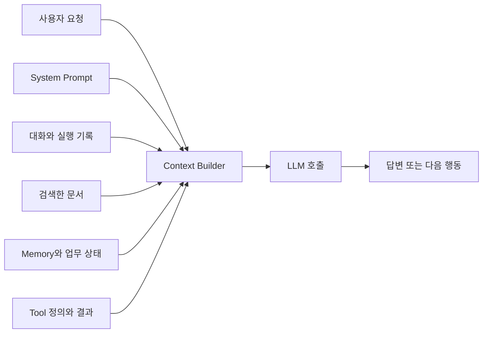
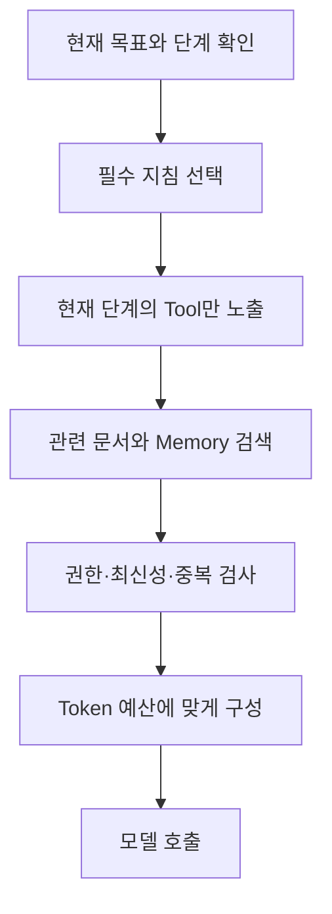
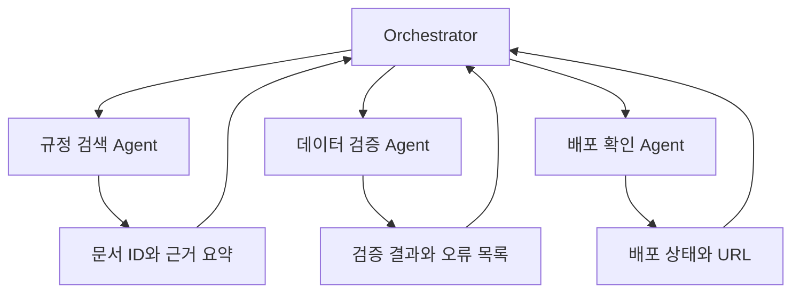
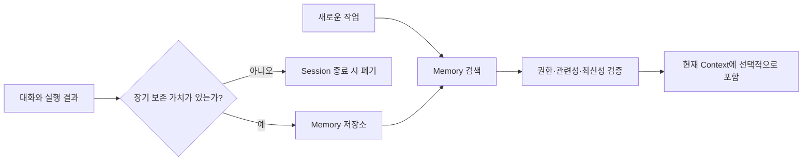
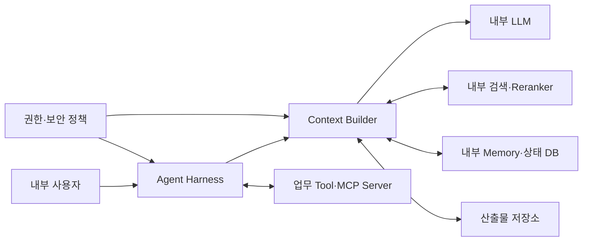

## 같은 Prompt인데 왜 결과가 달라질까?

Agent에게 다음과 같이 요청했다고 가정해보자.

> 최신 출장비 규정을 확인하고 변경된 내용을 정리해 주세요.

Prompt 자체는 분명해 보인다. 하지만 Agent가 올바른 답을 만들려면 Prompt 밖의 조건도 맞아야 한다.

- 최신 규정이 검색 결과에 포함돼 있어야 한다.
- 폐기된 규정과 현재 규정을 구분할 수 있어야 한다.
- 문서 조회 Tool의 설명과 입력 Schema가 명확해야 한다.
- 사용자의 권한과 기준일이 전달돼야 한다.
- 이전 작업에서 남은 잘못된 정보가 판단을 방해하지 않아야 한다.
- 긴 Tool 결과에서 필요한 부분을 찾을 수 있어야 한다.

System Prompt를 여러 번 고쳐도 검색 결과가 틀렸거나 필요한 상태가 빠져 있다면 답은 좋아지지 않는다. 반대로 같은 모델과 같은 지시를 사용해도 어떤 정보를 함께 제공하는지에 따라 결과가 달라질 수 있다.

**Context Engineering은 모델이 다음 행동을 결정하는 순간에 필요한 정보를 선택하고, 구성하고, 유지하는 작업**이다.

앞선 [Agent Harness 글](/posts/understanding-agent-harness/)에서는 Harness가 모델과 Tool, 상태, 실행 환경을 연결하는 방식을 살펴봤다. 이번 글에서는 Harness가 모델에 전달하는 Context를 어떻게 설계해야 하는지 정리한다.

## 1. Prompt Engineering과 Context Engineering은 무엇이 다를까?

Prompt Engineering은 주로 모델에게 전달할 지시문의 표현과 구조를 다룬다.

- 역할과 목표를 명확하게 작성한다.
- 출력 형식과 제약 조건을 지정한다.
- 좋은 예시를 제공한다.
- 모호한 표현을 줄인다.

Context Engineering은 범위가 더 넓다. 지시문뿐 아니라 **이번 모델 호출에 들어가는 전체 정보**를 관리한다.



| 구분 | Prompt Engineering | Context Engineering |
|---|---|---|
| 중심 질문 | 지시를 어떻게 표현할 것인가? | 지금 어떤 정보를 모델에 보여줄 것인가? |
| 주요 대상 | System Prompt, 사용자 Prompt, 예시 | Prompt, 대화 기록, 검색 결과, Tool, Memory, 실행 상태 |
| 적용 시점 | Prompt를 작성하거나 수정할 때 | 모델을 호출할 때마다 |
| 대표 실패 | 지시가 모호하거나 출력 형식이 불명확함 | 필요한 정보가 없거나 오래된 정보와 잡음이 너무 많음 |
| 개선 방법 | 지시와 예시를 명확하게 수정 | 선택, 검색, 압축, 상태 저장과 격리 방식을 수정 |

둘은 경쟁하는 개념이 아니다. 명확한 Prompt는 여전히 중요하다. 다만 여러 Tool을 사용하고 장시간 실행되는 Agent에서는 Prompt만 잘 작성해서 해결할 수 없는 문제가 늘어난다.

Anthropic은 Context Engineering을 System Prompt, Tool, 외부 데이터, 메시지 기록 등 모델 추론에 포함되는 Token을 선별하고 유지하는 작업으로 설명한다. 목표는 가능한 많은 정보를 넣는 것이 아니라 **원하는 행동에 도움이 되는 신호를 제한된 Context 안에 구성하는 것**이다. [Effective context engineering for AI agents](https://www.anthropic.com/engineering/effective-context-engineering-for-ai-agents)

## 2. Context Window와 실제 Context를 구분하기

Context Window는 모델이 한 번의 추론에서 처리할 수 있는 Token 범위다. 실제 Context는 그 범위 안에 이번 호출을 위해 넣은 내용이다.

Context Window가 크다고 해서 모든 정보를 넣는 것이 좋은 전략은 아니다.

1. 입력 Token이 늘면 비용과 전송량이 증가한다.
2. 긴 입력은 응답 지연을 늘릴 수 있다.
3. 오래된 정보와 관련 없는 내용이 현재 판단을 방해한다.
4. 중요한 제약이 긴 로그와 문서 사이에 묻힐 수 있다.
5. 서로 충돌하는 정보가 들어오면 어느 것을 따라야 하는지 모호해진다.

Anthropic은 Context가 길어질수록 필요한 정보를 정확히 활용하는 능력이 점진적으로 떨어질 수 있는 현상을 **Context Rot**으로 설명한다. 이는 Context Window의 최대 크기를 넘었을 때만 생기는 문제가 아니다. 허용 범위 안에서도 정보의 밀도와 배치가 좋지 않으면 성능이 떨어질 수 있다.

> Context Window는 저장 공간의 최대 크기이고, Context Engineering은 그 공간에 무엇을 담을지 정하는 일이다.

큰 Context Window는 선택의 여유를 주지만 선택 자체를 대신해주지는 않는다.

## 3. Agent의 Context에는 무엇이 들어갈까?

Agent의 Context를 구성 요소별로 나누면 문제를 찾기 쉬워진다.

| 구성 요소 | 담는 내용 | 잘못 구성했을 때 생기는 문제 |
|---|---|---|
| System Prompt | 역할, 원칙, 금지 사항, 완료 조건 | 목표가 모호하거나 규칙이 충돌함 |
| 사용자 요청 | 현재 목표, 추가 조건, 수정 사항 | 이전 요청을 현재 요청으로 오해함 |
| 대화 기록 | 합의한 내용과 최근 상호작용 | 오래된 요구가 계속 남거나 중요한 결정이 잘림 |
| Tool 정의 | 이름, 설명, 입력 Schema와 사용 조건 | 잘못된 Tool이나 인자를 선택함 |
| Tool 결과 | 조회 결과, 오류와 상태 변화 | 큰 응답에 핵심 정보가 묻히거나 실패를 성공으로 해석함 |
| 검색 문서 | 질문과 관련된 근거 | 오래되거나 권한이 없는 문서를 사용함 |
| 업무 상태 | 완료 항목, 미해결 항목, 기준일, 권한 | 완료 작업을 반복하거나 잘못된 상태에서 이어감 |
| Memory | 장기간 유지할 사용자·업무 정보 | 부정확한 기억이 다음 작업을 계속 오염시킴 |
| 산출물 참조 | 파일 경로, 문서 ID, 데이터 위치 | 큰 결과를 반복해서 Context에 복사함 |

모든 요소를 매번 넣을 필요는 없다. 현재 작업과 단계에 따라 필요한 Context가 달라진다.

예를 들어 첫 번째 단계에서는 검색 Tool의 정의가 필요하지만, 문서를 선택한 뒤 보고서를 작성하는 단계에서는 선택한 문서와 출력 조건이 더 중요하다. 이미 사용이 끝난 Tool 정의와 수천 줄의 원본 검색 결과까지 계속 유지하면 Context만 커진다.

## 4. 좋은 Context는 많기보다 밀도가 높다

Context의 품질을 네 가지 기준으로 볼 수 있다.

### 관련성

현재 목표와 결정에 직접 필요한 정보인가?

출장비 규정 변경점을 찾는 작업에 과거 복리후생 규정 전체를 넣을 필요는 없다. 검색 결과가 질문의 단어와 비슷하다는 이유만으로 관련성이 보장되는 것도 아니다.

### 정확성

출처, 기준일과 상태가 확인된 정보인가?

문서 제목만 전달하기보다 문서 ID, 시행일, 버전과 폐기 여부를 함께 제공하면 Agent가 최신본을 선택하기 쉽다.

### 최신성

현재 상태를 반영하고 있는가?

이전 Tool 결과보다 방금 조회한 데이터베이스 상태가 우선돼야 한다. 여러 정보가 충돌할 때 무엇을 신뢰할지 기준도 필요하다.

### 실행 가능성

Agent가 다음 행동을 결정할 수 있는 형태인가?

“조회 실패”만 반환하면 복구하기 어렵다. 오류 코드, 재시도 가능 여부와 입력에서 잘못된 필드를 함께 반환하면 다음 행동을 선택할 수 있다.

```text
나쁜 Tool 결과
조회에 실패했습니다.

개선된 Tool 결과
status: failed
error_code: INVALID_DATE_RANGE
message: end_date는 start_date 이후여야 합니다.
retryable: true
```

정보의 양보다 **다음 판단에 필요한 신호가 얼마나 분명한지**가 중요하다.

## 5. Context를 선택해서 넣기

가장 먼저 적용할 방법은 필요 없는 정보를 처음부터 넣지 않는 것이다.



실무에서는 다음과 같은 선택 규칙을 사용할 수 있다.

- 최근 대화는 그대로 유지하되 오래된 대화는 결정 사항만 남긴다.
- 현재 사용자에게 허용된 Tool만 제공한다.
- 현재 단계에서 사용할 가능성이 있는 Tool 정의만 불러온다.
- 검색 결과는 점수만 보지 않고 권한, 시행일과 문서 상태를 검사한다.
- 중복 문서와 같은 내용의 이전 버전을 제거한다.
- 큰 결과는 원문 전체 대신 식별자와 필요한 구간을 전달한다.
- 변경 가능한 업무 상태는 호출 직전에 다시 조회한다.

Anthropic은 필요한 데이터를 미리 전부 넣는 방식과 함께, 파일 경로·문서 ID·검색어 같은 가벼운 참조를 유지하다가 Agent가 필요한 순간에 Tool로 읽는 **Just-in-time Context** 방식을 소개한다.

이 방식은 Context를 작게 유지할 수 있지만 대가도 있다. Agent가 탐색을 잘못하거나 불필요한 Tool Call을 반복할 수 있고, 사전 검색보다 응답이 느릴 수 있다. 따라서 핵심 규칙과 현재 상태는 미리 제공하고 큰 문서와 상세 자료는 필요할 때 읽는 혼합 방식이 실용적이다.

## 6. 큰 결과는 Context 밖에 기록하기

Tool이 반환한 큰 데이터나 중간 산출물을 계속 메시지 기록에 붙이면 Context가 빠르게 커진다. 원본은 외부 저장소에 보관하고 Context에는 위치와 요약만 남길 수 있다.

```text
artifact_id: report-source-20260928
path: /workspace/sources/travel-policy.json
records: 1,248
schema: policy_id, title, effective_date, status, body
selected_ids: TRAVEL-2026, TRAVEL-2025
next_action: 두 문서의 숙박비 한도와 예외 조항 비교
```

Agent는 필요한 경우 파일의 일부를 다시 읽거나 조건을 지정해 조회한다. 이 방법은 다음 상황에 특히 유용하다.

- 수천 행의 데이터베이스 조회 결과
- 긴 문서와 PDF 추출 결과
- 코드 저장소 검색 결과
- 여러 단계에서 만든 표와 보고서
- 반복 실행에 필요한 Checkpoint

Context 안에는 모든 데이터를 복사하기보다 **어디에 무엇이 있고 다음에 어떻게 사용할지** 남긴다.

단, 외부에 기록한 내용이 자동으로 기억되는 것은 아니다. 파일 경로, 버전, 생성 시각과 용도를 다시 찾을 수 있도록 상태에 등록해야 한다.

## 7. 오래된 Context는 압축하기

장시간 실행되는 Agent는 결국 Context를 정리해야 한다. 대표적인 방법은 Trimming과 Summarization이다.

| 방법 | 동작 | 장점 | 위험 |
|---|---|---|---|
| Trimming | 오래된 Turn이나 Tool 결과를 제거 | 단순하고 결과를 예측하기 쉬움 | 중요한 과거 조건이 갑자기 사라질 수 있음 |
| Summarization | 이전 기록을 짧은 요약으로 교체 | 긴 작업의 결정과 진행 상태를 유지 | 요약 과정에서 정보가 왜곡되거나 누락될 수 있음 |
| 구조화 상태 | 핵심 값을 별도 Schema로 저장 | 검증과 복구가 쉬움 | 무엇을 저장할지 미리 설계해야 함 |
| Native Compaction | 플랫폼 기능으로 이전 Context를 압축 | 장시간 작업을 쉽게 이어갈 수 있음 | 압축 결과의 동작과 한계를 평가해야 함 |

OpenAI의 Context Engineering Cookbook도 Trimming은 단순하고 재현하기 쉽지만 장기 정보를 잃을 수 있고, Summarization은 장기 정보를 압축해 유지하지만 누락과 왜곡을 관리해야 한다고 설명한다. [Short-Term Memory Management with Sessions](https://developers.openai.com/cookbook/examples/agents_sdk/session_memory)

좋은 요약은 단순한 대화 줄거리가 아니다. 다음 실행에 필요한 상태를 보존해야 한다.

```yaml
goal: 2025년과 2026년 출장비 규정 비교 보고서 작성
confirmed_facts:
  - 최신 문서 ID는 TRAVEL-2026이다.
  - TRAVEL-2025는 2026-01-01에 폐기됐다.
decisions:
  - 금액은 원문 표를 기준으로 비교한다.
completed:
  - 두 문서의 시행일과 상태 확인
pending:
  - 지역별 숙박비 차이 계산
constraints:
  - 금액마다 문서 ID와 조항 번호를 표시한다.
artifacts:
  - /workspace/sources/travel-2025.json
  - /workspace/sources/travel-2026.json
```

ID, 날짜, 금액, 파일 경로와 금지 조건처럼 정확해야 하는 값은 자연어 요약에만 의존하지 않는 편이 좋다. 구조화 상태나 원본 참조와 함께 보관한다.

OpenAI는 장시간 Tool 기반 작업에서 Context가 한계에 가까워질 때 핵심 상태를 보존하는 Compaction을 사용한다고 설명한다. 중요한 것은 압축 기능의 존재보다 **압축 전후에 Agent가 같은 목표와 제약을 유지하는지 평가하는 것**이다. [From model to agent](https://openai.com/index/equip-responses-api-computer-environment/)

## 8. 작업을 격리해 Context 간섭 줄이기

하나의 Agent가 서로 다른 작업의 Context를 모두 들고 있으면 관련 없는 정보가 섞인다.

예를 들어 다음 세 작업은 필요한 정보가 다르다.

1. 사내 규정 검색
2. 데이터베이스 품질 점검
3. 배포 결과 확인

각 작업을 독립 Session이나 Subagent로 분리하면 세부 Context가 서로 간섭하는 것을 줄일 수 있다. 상위 Agent는 전체 목표와 진행 상태만 관리하고, 하위 작업은 필요한 자료와 Tool만 전달받는다.



격리의 장점은 병렬 처리만이 아니다.

- 각 Agent에 필요한 Tool만 제공할 수 있다.
- 작업별 Context를 작고 명확하게 유지할 수 있다.
- 민감한 데이터의 전달 범위를 줄일 수 있다.
- 실패한 작업만 다시 실행할 수 있다.
- 상위 Context에는 상세 로그 대신 결과만 반환할 수 있다.

다만 작업이 작거나 서로 강하게 의존한다면 분리 비용이 더 클 수 있다. Subagent를 늘리는 것이 목표가 아니라 **한 번의 판단에 관련 없는 Context가 섞이지 않게 하는 것**이 목표다.

## 9. Memory와 Context는 같은 것이 아니다

Memory는 여러 Session이나 장기간에 걸쳐 보존할 정보다. Context는 이번 모델 호출에서 실제로 모델에게 제공한 정보다.

Memory에 저장돼 있어도 검색하지 않으면 현재 Context에 들어오지 않는다. 반대로 현재 Context에 있다고 해서 장기 Memory로 보존되는 것도 아니다.



Memory에는 다음과 같은 정책이 필요하다.

- 무엇을 저장할 것인가?
- 누가 읽고 수정할 수 있는가?
- 언제 만료하거나 삭제할 것인가?
- 사용자가 수정한 정보와 시스템이 추론한 정보를 어떻게 구분할 것인가?
- 새로운 정보와 충돌하면 무엇을 우선할 것인가?
- 잘못 저장된 Memory가 반복 사용되는지 어떻게 평가할 것인가?

사용자의 명시적 선호와 확인된 업무 사실은 저장 가치가 있을 수 있다. 일회성 오류 메시지, 모델의 추측과 오래된 진행 상황까지 모두 Memory에 넣으면 다음 작업을 오염시킨다.

Memory는 Context를 무한히 확장하는 장치가 아니다. **필요할 때 검증해서 다시 불러올 수 있는 외부 정보원**으로 보는 편이 안전하다.

## 10. Context 실패를 유형별로 진단하기

Agent의 오답을 모두 모델 문제로 분류하면 개선 지점을 찾기 어렵다.

| 실패 유형 | 증상 | 먼저 확인할 부분 |
|---|---|---|
| 누락 | 필요한 규정이나 사용자 조건을 사용하지 않음 | 검색 Recall, Context 선택 규칙 |
| 과잉 | 불필요한 문서와 로그를 지나치게 전달 | Tool 결과 크기, 검색 개수, 중복 제거 |
| 오래된 정보 | 폐기 문서나 이전 상태를 사용 | 기준일, Cache, 최신성 검사 |
| 충돌 | 서로 다른 지시나 상태를 동시에 따름 | 정보 우선순위와 버전 |
| 오염 | 이전의 잘못된 추측을 사실처럼 재사용 | Memory와 요약 갱신 규칙 |
| 압축 손실 | 요약 후 ID, 숫자나 제약을 잊음 | Compaction 전후 상태 비교 |
| Tool 혼동 | 비슷한 Tool을 잘못 선택 | Tool 이름, 설명, 동적 노출 |
| 권한 누출 | 사용자에게 허용되지 않은 정보를 전달 | 검색 전 권한 필터와 출력 검사 |

[AI Agent 평가 글](/posts/understanding-ai-agent-evaluation/)에서 살펴본 것처럼 Context 변경도 반복 Trial로 평가해야 한다. 전체 답변 점수만 볼 것이 아니라 다음 항목을 별도로 기록하면 원인을 찾기 쉽다.

- 정답 문서가 검색 결과에 포함된 비율
- 선택한 Context 중 실제 답변에 필요했던 정보의 비율
- 오래되거나 중복된 문서가 포함된 횟수
- Tool 선택과 인자 생성 성공률
- Compaction 전후 필수 제약 보존율
- 입력 Token, 응답 시간과 Tool Call 수
- 권한이 없는 문서가 검색·출력된 횟수

Context를 줄였더니 Token은 감소했지만 최신 문서를 놓칠 수도 있다. 하나의 수치보다 정확성, 비용, 지연과 보안을 함께 비교해야 한다.

## 11. 폐쇄망 Agent에서는 어떻게 적용할까?

폐쇄망에서는 외부 검색과 SaaS Memory를 사용하기 어렵다. 대신 내부 문서, 데이터베이스, 파일 저장소와 업무 시스템을 연결해 Context 공급 경로를 구성한다.



폐쇄망이라고 Context가 자동으로 안전해지는 것은 아니다. 다음 항목을 별도로 관리해야 한다.

### 검색 전 권한 적용

검색한 뒤 모델이 알아서 제외하게 하지 않는다. 사용자와 업무 권한으로 접근 가능한 문서만 검색 단계에서 반환한다.

### 문서 버전과 기준일 제공

내부 문서는 제목이 같아도 시행일과 상태가 다를 수 있다. 문서 ID, 개정 번호, 시행일과 폐기 여부를 Metadata로 전달한다.

### Tool 결과 크기 제한

데이터베이스 전체 결과를 모델에 넣지 않는다. 코드에서 필터링·집계하고 판단에 필요한 행과 통계만 Context에 포함한다.

### 원문과 요약 분리 저장

요약은 검색과 판단을 돕지만 감사와 재현에는 원문이 필요하다. 답변이 참조한 문서 ID, Chunk와 Hash를 기록한다.

### 민감정보 최소화

로그, 요약과 Memory에 개인정보와 Credential이 남지 않도록 필드를 제거하거나 Masking한다. 업무 수행에 필요했던 정보도 목적이 끝나면 유지 기간에 따라 삭제한다.

### 전체 버전 기록

같은 질문의 결과가 달라졌다면 모델만 확인해서는 안 된다. System Prompt, 검색 Index, Embedding, Reranker, Tool, Context Builder와 Memory 정책의 버전을 함께 남긴다.

폐쇄망 Context Engineering의 핵심은 많은 내부 데이터를 모델에 전달하는 것이 아니다. **사용자의 권한과 현재 업무 단계에 맞는 최소한의 근거를 재현 가능한 방식으로 제공하는 것**이다.

## 12. 가장 작은 Context Engineering 적용 순서

처음부터 복잡한 Memory나 Multi-agent 구조를 만들 필요는 없다. 다음 순서로 시작할 수 있다.

1. **현재 Context를 관찰한다.** 모델에 실제로 들어간 지시, 문서, Tool 정의와 결과 크기를 기록한다.
2. **불필요한 내용을 제거한다.** 중복 문서, 오래된 Tool 결과와 사용하지 않는 Tool 정의부터 줄인다.
3. **업무 상태를 구조화한다.** 목표, 완료 항목, 제약, ID와 산출물 경로를 메시지 밖의 상태로 관리한다.
4. **큰 결과를 외부화한다.** 원본은 파일이나 DB에 저장하고 Context에는 참조와 필요한 구간만 넣는다.
5. **오래된 기록을 압축한다.** 최근 Turn은 유지하고 이전 내용은 검증 가능한 상태와 요약으로 교체한다.
6. **실패 사례로 평가한다.** 누락, 오래된 정보, Tool 혼동과 압축 손실을 평가 Dataset에 추가한다.
7. **필요할 때만 격리한다.** Context 간섭이 확인된 독립 작업을 별도 Session이나 Agent로 분리한다.

다음 체크리스트도 사용할 수 있다.

| 확인 항목 | 질문 |
|---|---|
| 목표 | 현재 사용자의 최종 목표가 한 문장으로 명확한가? |
| 제약 | 권한, 금지 사항과 완료 조건이 보존됐는가? |
| 검색 | 최신이며 접근 가능한 근거가 포함됐는가? |
| Tool | 현재 단계에 필요한 Tool만 명확하게 제공했는가? |
| 상태 | 완료·미완료 항목을 프로그램이 확인할 수 있는가? |
| 결과 | 큰 Tool 결과를 그대로 반복해서 넣고 있지 않은가? |
| 압축 | 숫자, ID, 경로와 중요한 결정이 유지됐는가? |
| Memory | 저장 근거, 갱신과 삭제 규칙이 있는가? |
| 관찰성 | 어떤 Context로 결과가 생성됐는지 재현할 수 있는가? |
| 평가 | Context 변경 전후를 같은 Task로 비교했는가? |

## Context는 Agent가 바라보는 세계다

모델은 업무 시스템 전체를 직접 보는 것이 아니다. Harness가 선택해 전달한 Context를 통해 현재 목표, 사용할 수 있는 Tool과 외부 상태를 이해한다.

따라서 Agent가 잘못된 판단을 했을 때 Prompt 문장만 계속 수정해서는 해결되지 않을 수 있다. 필요한 문서가 검색됐는지, 최신 상태가 전달됐는지, Tool 결과가 지나치게 크지 않은지, 중요한 제약이 압축 과정에서 사라지지 않았는지 함께 확인해야 한다.

Context Engineering은 정보를 많이 넣는 기술이 아니다. **현재 결정에 필요한 신호를 선택하고, 큰 정보는 외부에 기록하며, 오래된 기록은 압축하고, 서로 다른 작업은 필요에 따라 격리하는 설계 작업**이다.

좋은 Context는 모델이 모든 것을 기억하게 만들지 않는다. 지금 해야 할 일을 정확히 판단할 수 있을 만큼만 보여준다.
