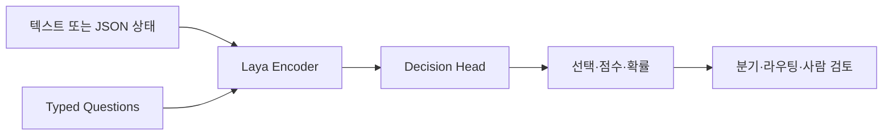
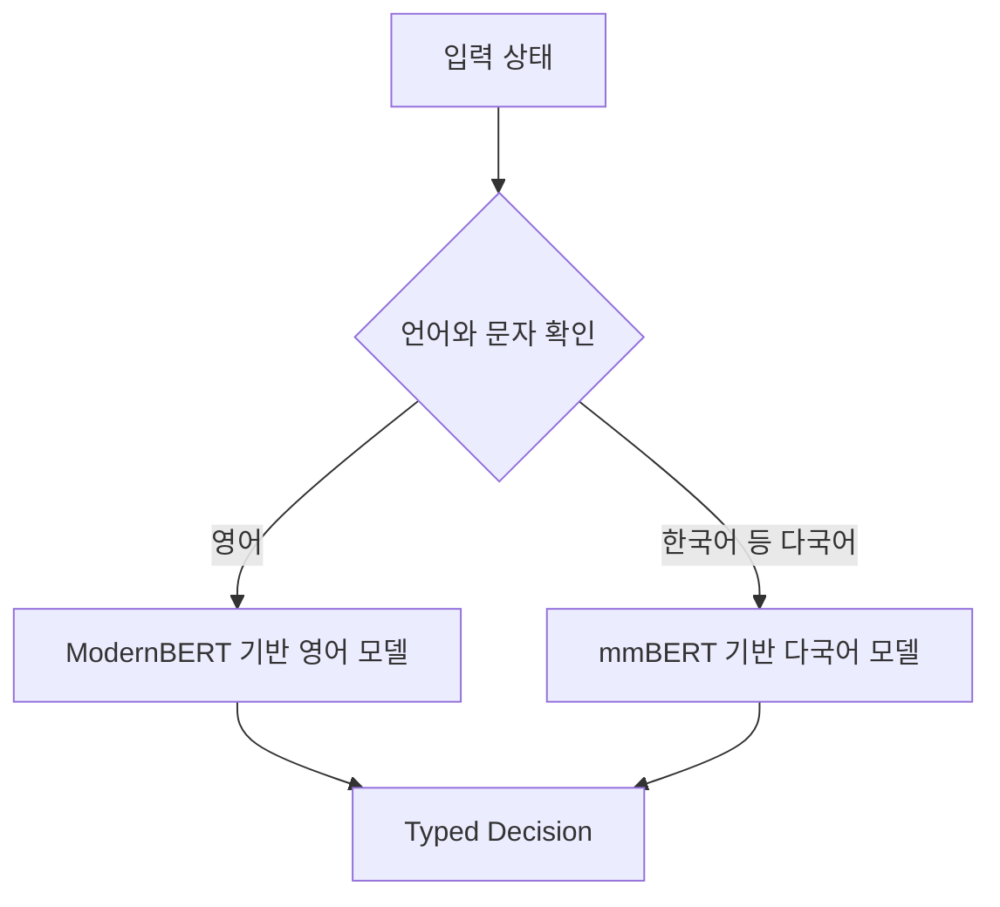
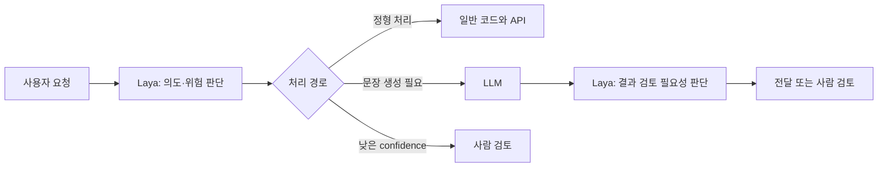

## Jev와 비슷한 모델을 직접 실행할 수 있을까?

앞선 [TypeSafe AI Jev 글](/posts/typesafe-ai-jev/)에서는 문장을 생성하는 대신 `Choice`·`Score`·`Noul` 형태의 결정을 반환하는 System One 모델을 살펴봤다. Jev는 빠르고 구조화된 판단을 API로 제공하지만, 가중치와 모델 구조가 공개되지 않은 호스팅 서비스다.

**Laya**는 같은 종류의 문제를 오픈소스로 풀려는 프로젝트다. 텍스트나 JSON 상태와 미리 정의한 질문을 입력하면, 자유 형식 문장 대신 선택·점수·확률을 반환한다. Apache 2.0 라이선스로 모델 가중치가 공개되어 있어 직접 실행하고 업무 데이터에 맞게 조정할 수 있다. [Laya Hugging Face 모델 카드](https://huggingface.co/convaiinnovations/laya)

다만 Laya를 Jev의 이전 버전이나 TypeSafe AI가 공개한 모델로 이해하면 안 된다. Laya는 ConvAI Innovations가 만든 별개의 모델이며, Jev의 `/v1/systemone` 요청·응답 형식과 호환되는 오픈소스 대안이다.

## 1. Laya는 무엇을 생성하지 않는가?

일반적인 LLM은 입력을 받은 뒤 다음 토큰을 하나씩 생성한다. JSON 출력 형식을 강제하더라도 기본 동작은 문자열 생성이다. Laya는 이 과정 대신 입력 전체를 읽고 정해진 후보의 점수를 한 번의 Forward Pass로 계산한다.



예를 들어 고객 문의를 받았을 때 답변 문장을 작성하는 대신 다음과 같은 판단만 수행한다.

- 담당 부서는 결제·기술·영업 중 어디인가?
- 문의의 긴급도는 어느 단계인가?
- 사람이 검토해야 할 가능성은 얼마인가?

출력 범위가 미리 정해져 있으므로 존재하지 않는 부서 이름이나 깨진 JSON을 생성하지 않는다. 그러나 **형식 밖의 값을 만들지 않는 것과 올바른 판단을 하는 것은 별개**다. `technical`을 반환해야 할 입력에 `billing`을 반환할 가능성까지 없어지는 것은 아니다.

## 2. Jev의 전신이 아니라 호환되는 별도 프로젝트다

Laya 개발자는 2025년부터 비자동회귀 방식으로 대화 상태의 확률을 예측하는 연구와 모델을 공개했고, 이후 그 경험을 범용적인 결정 모델로 확장해 Laya를 만들었다고 설명한다. 반면 TypeSafe AI는 Jev를 2년 동안 비공개로 개발한 뒤 2026년 9월 15일 공개했다고 밝혔다. [Laya 개발 배경](https://laya.convaiinnovations.com/), [TypeSafe AI의 Jev 발표](https://typesafe.ai/blog/introducing-system-one-models-and-jev)

공개된 자료만으로 어느 한쪽이 다른 쪽에서 직접 파생됐다고 판단할 근거는 없다. 현재 확인할 수 있는 관계는 다음과 같다.

| 구분 | Jev | Laya |
|---|---|---|
| 개발 주체 | TypeSafe AI | ConvAI Innovations |
| 제공 방식 | 관리형 API | 공개 가중치·로컬 실행 |
| 라이선스 | 상용 서비스 | Apache 2.0 |
| 모델 구조 | 상세 비공개 | Encoder와 Decision Head 공개 |
| API | `/v1/systemone` | 같은 형식의 호환 서버 제공 |
| 조정 가능성 | 공개 문서상 가중치 조정 불가 | 직접 Fine-tuning 가능 |

따라서 Laya는 **Jev와 같은 인터페이스를 사용하는 독립적인 오픈소스 구현**으로 보는 편이 정확하다.

## 3. 생성 모델 대신 Encoder를 사용한다

Laya의 영어 모델은 `ModernBERT-large`를 기반으로 한다. 입력을 양방향으로 읽는 Encoder 뒤에 별도의 Decision Head를 붙이며, 전체 크기는 약 4억 2천만 파라미터다. 다국어 모델은 `mmBERT-base`를 사용하며 약 3억 2천만 파라미터다.

질문의 각 선택지는 입력 안에 있는 Option Marker와 연결된다. Decision Head가 각 Marker의 점수를 계산하고, 같은 질문에 속한 후보끼리 Softmax를 적용해 확률 분포를 만든다. 후보가 요청 시점에 정의되기 때문에 새로운 분류 항목을 추가할 때마다 출력 레이어를 새로 만들 필요는 없다. [Laya 공개 구조](https://github.com/NandhaKishorM/laya#architecture)

```text
상태: "결제가 두 번 처리됐습니다. 빨리 환불해 주세요."

질문: 어느 부서에서 처리해야 하는가?
후보: billing / technical / sales

결과 예시:
billing   0.91
technical 0.06
sales     0.03
```

여러 질문을 한 요청에 넣으면 질문마다 모델을 다시 호출하는 대신 하나의 Batch로 묶어 처리한다. 자유 형식 답변을 토큰 단위로 생성하지 않으므로, 분류와 라우팅처럼 출력 범위가 작은 작업에서 지연 시간을 줄일 수 있다.

## 4. Choice·Score·Noul은 무엇을 반환할까?

Laya는 Jev와 동일하게 세 가지 질문 형태를 사용한다.

| 질문 타입 | 의미 | 활용 예시 |
|---|---|---|
| `choice` | 여러 후보 중 하나를 선택하고 후보별 확률 반환 | 담당 부서·의도·Tool 선택 |
| `score` | 순서가 있는 기준의 단계와 분포 반환 | 긴급도·위험도·불만 수준 |
| `noul` | 명제가 참일 확률 반환 | 스팸·피싱·이탈 가능성 판단 |

`choice`와 `score`에는 선택 결과뿐 아니라 확률 분포와 confidence가 포함된다. `noul`은 참일 확률 `P(true)`를 0과 1 사이의 값으로 반환한다.

이 값은 바로 실행 명령이 아니다. 애플리케이션이 업무 위험에 따라 임계값을 정해야 한다.

```text
confidence >= 0.90  → 자동 처리
0.70 이상           → 결과를 기록하고 처리
0.70 미만           → 사람에게 전달
```

임계값은 예시일 뿐이다. 실제로는 업무 데이터에서 confidence 구간별 정확도와 자동 처리율을 측정한 뒤 정해야 한다.

## 5. 세 모델을 구분해서 사용해야 한다

Laya는 하나의 모델이 모든 언어와 작업에서 같은 성능을 내지 않는다는 전제로 세 Checkpoint를 제공한다.

| Checkpoint | 기반 Encoder | 기본 Context | 적합한 작업 |
|---|---|---|---|
| `laya` | ModernBERT-large | 512 tokens | 영어 분류·Guardrail·메일 처리 |
| `laya-multilingual` | mmBERT-base | 1,024 tokens | 한국어를 포함한 다국어 입력 |
| `laya-typed-decisions` | ModernBERT-large | 1,024 tokens | 공개된 Typed Decision Workflow |

영어 모델에 한국어를 그대로 넣어도 오류가 발생하지는 않는다. 더 위험한 점은 입력을 제대로 처리하지 못하면서 높은 confidence를 반환할 수 있다는 것이다. 공식 모델 카드에서도 영어 Checkpoint가 일부 비라틴 문자 언어에서 정확도가 무너졌지만 confidence는 높게 유지된 사례를 공개한다.

Laya의 `Router`는 입력 문자와 언어 특성을 먼저 확인해 영어 모델과 다국어 모델 중 하나를 선택한다.



모델의 confidence만 보고 잘못된 언어 선택을 발견할 수 없으므로, 한국어 서비스를 만들 때는 처음부터 다국어 Checkpoint 또는 Router를 사용해야 한다.

## 6. Python에서 직접 실행하기

Laya는 Python 3.10 이상에서 설치할 수 있다.

```bash
pip install laya
```

다음 예제는 Router가 입력에 맞는 모델을 선택하고 세 가지 질문을 함께 처리하는 구조를 보여준다.

```python
from laya import Router


router = Router()

ticket = {
    "message": "결제가 두 번 처리됐습니다. 오늘 안에 환불해 주세요."
}

questions = {
    "department": {
        "type": "choice",
        "instructions": "어느 부서에서 처리해야 합니까?",
        "criteria": {
            "billing": "결제, 청구 또는 환불 문제",
            "technical": "오류, 장애 또는 연동 문제",
            "sales": "가격, 구매 또는 계약 문의",
        },
    },
    "urgency": {
        "type": "score",
        "instructions": "문의의 긴급도를 평가하세요.",
        "criteria": ["낮음", "보통", "높음"],
    },
    "needs_human": {
        "type": "noul",
        "instructions": "사람의 검토가 필요한 요청입니까?",
    },
}

result = router.predict(ticket, questions)

department = result["answers"]["department"]

if department["confidence"] >= 0.9:
    assign_to_team(department["choice"])
else:
    route_to_human(ticket)
```

첫 실행에서는 Hugging Face에서 모델 파일을 내려받고 메모리에 적재하므로 시간이 걸릴 수 있다. 운영 환경에서는 필요한 Checkpoint를 미리 내려받고, 서버 시작 시 적재해 Cold Start를 피해야 한다. 정확한 반환 필드와 설치 옵션은 버전에 따라 달라질 수 있으므로 [공식 저장소의 Quick Start](https://github.com/NandhaKishorM/laya)를 함께 확인해야 한다.

## 7. Jev API를 Laya로 바꿀 수 있다

Laya는 Jev와 같은 `POST /v1/systemone` 형식의 HTTP 서버를 제공한다.

```bash
pip install "laya[serve]"
LAYA_DEVICE=cuda LAYA_PRELOAD=1 laya-serve
```

서버가 실행되면 로컬 주소로 요청할 수 있다.

```bash
curl http://localhost:8000/v1/systemone \
  -H 'Content-Type: application/json' \
  -d '{
    "state": {
      "message": "결제가 두 번 처리됐습니다."
    },
    "questions": {
      "is_billing": {
        "type": "noul",
        "instructions": "결제와 관련된 문의입니까?"
      }
    }
  }'
```

기존 Jev Client가 Base URL을 설정할 수 있다면 요청을 만드는 코드를 크게 바꾸지 않고 Laya 서버로 연결할 수 있다. 하지만 **API가 호환된다는 것이 두 모델의 판단 결과까지 동일하다는 뜻은 아니다.** 모델, 학습 데이터, calibration이 다르므로 같은 요청에서도 선택과 확률이 달라질 수 있다.

또한 기본 Laya 서버는 인증 없이 `0.0.0.0`에 연결될 수 있다. 외부에서 접근 가능한 환경이라면 `LAYA_API_KEY`를 설정하고, 방화벽과 TLS를 포함한 별도의 접근 제어를 적용해야 한다. [Laya 자체 호스팅 문서](https://huggingface.co/convaiinnovations/laya#self-hosting-jev-compatible-http-server)

## 8. 폐쇄망에서 사용할 때 확인할 것

Laya의 공개 가중치는 외부 API 호출이 어려운 환경에서 Jev와 구분되는 가장 큰 특징이다. 필요한 파일과 Python 의존성을 외부망에서 준비해 반입하면 추론 요청을 내부에서 처리할 수 있다.

그렇다고 `pip install laya`만으로 폐쇄망 준비가 끝나는 것은 아니다.

1. 사용할 Checkpoint와 Tokenizer 파일을 함께 반입한다.
2. PyTorch를 포함한 의존성 Wheel이 대상 OS·Python·CUDA와 맞는지 확인한다.
3. 실행 중 Hugging Face에 접속하지 않도록 로컬 경로와 Offline 설정을 사용한다.
4. 모델 파일의 버전과 Hash를 기록한다.
5. 서버 인증과 접근 가능한 네트워크 범위를 제한한다.
6. 한국어 업무 데이터를 별도로 평가하고 임계값을 고정한다.

가중치가 내부에 있다는 사실은 데이터 유출 경로 하나를 줄여줄 뿐이다. 입력 로그, 결과 저장소, 모델 서버 권한과 운영 모니터링은 여전히 별도로 설계해야 한다.

## 9. 공개 Benchmark는 어떻게 읽어야 할까?

공식 모델 카드는 Tesla T4에서 다국어 모델이 한 질문을 약 32.8ms에 처리하고, 질문 10개를 묶으면 전체 약 72.3ms가 걸렸다고 제시한다. 이 수치는 Laya 개발자가 특정 하드웨어와 입력으로 측정한 결과다. CPU, Apple Silicon, 입력 길이, 질문과 후보 수, Batch 크기에 따라 실제 지연은 달라진다.

Jev와 비교한 표도 그대로 일반화하면 안 된다. 모델 카드 자체가 Laya와 Jev의 일부 수치는 서로 다른 평가자가 다른 표본과 Prompt로 측정했음을 밝히고 있다. 같은 테스트 데이터, 같은 질문 정의, 같은 성공 조건으로 나란히 실행한 결과가 아니면 모델 간 우열을 단정하기 어렵다.

더 중요한 내용은 공식 문서에 함께 공개된 실패 사례다.

- 기본 Checkpoint의 Zero-shot 성능은 특정 Typed Decision 평가에서 무작위 기준과 큰 차이가 없었다.
- 업무에 맞게 Fine-tuning한 Checkpoint는 같은 평가에서 크게 개선됐다.
- 기본 확률은 일부 평가에서 과도하게 자신하는 경향을 보였으며 별도 Temperature 보정이 필요했다.
- 영어 모델은 비라틴 문자 입력에서 높은 confidence로 틀릴 수 있었다.
- 입력이 Context 한도를 넘으면 뒤쪽 내용이 잘릴 수 있다.

따라서 Laya를 범용 지능 모델로 보기보다는 **특정 업무에 맞춰 평가하고 조정할 수 있는 빠른 결정 모델 기반**으로 보는 것이 적절하다.

## 10. 어떤 업무에 잘 맞을까?

Laya는 선택지와 성공 조건을 미리 정의할 수 있고 같은 판단을 반복하는 업무에 잘 맞는다.

- 고객 문의의 담당 부서와 우선순위 결정
- Agent가 사용할 Tool이나 다음 Workflow 선택
- 스팸·피싱·Prompt Injection 가능성 분류
- 문서의 검토 필요성이나 위험도 점수화
- 대량 데이터에 정해진 Label 부여
- 낮은 confidence의 요청을 사람에게 전달

반대로 다음 작업은 Laya의 목적과 맞지 않는다.

- 이메일과 보고서 작성
- 긴 문서의 자연어 요약
- 새로운 코드 생성
- 여러 단계의 계획 수립
- 후보를 미리 정할 수 없는 탐색형 질문

이런 작업에서는 일반 LLM이 내용을 만들고, Laya가 작업 전후의 분류·라우팅·검토 필요성을 판단하는 구성을 생각할 수 있다.



모델을 하나 더 추가하면 장애 지점과 평가 대상도 늘어난다. 단순 규칙이나 기존 분류 모델로 충분한 업무라면 Laya를 연결하지 않는 편이 더 간단할 수 있다.

## 11. 직접 평가한다면 무엇을 측정할까?

도입 전에는 실제 업무에서 수집한 정답 데이터로 다음 항목을 확인해야 한다.

| 평가 항목 | 확인할 내용 |
|---|---|
| 정확도 | 선택과 점수가 실제 업무 정답과 일치하는가 |
| Calibration | confidence 0.9인 결과가 실제로 약 90% 맞는가 |
| 언어 | 한국어와 영문 혼합 입력에서도 결과가 유지되는가 |
| 표현 변화 | 같은 의미의 문장을 바꿔 써도 판단이 일관적인가 |
| 미포함 사례 | 어떤 후보에도 속하지 않는 입력을 사람에게 넘길 수 있는가 |
| 지연 시간 | 실제 장비에서 평균·p95 시간이 얼마인가 |
| 처리량 | 여러 요청과 질문을 Batch로 묶었을 때 얼마나 처리하는가 |
| 자원 사용량 | Checkpoint별 RAM·VRAM 사용량은 얼마인가 |
| 장애 처리 | 모델 적재 실패·Timeout·낮은 confidence를 어떻게 처리하는가 |

비교 대상에는 Jev나 일반 LLM만 넣을 필요가 없다. 규칙 기반 코드, 작은 분류 모델, Embedding 유사도처럼 더 단순한 기준선도 함께 측정해야 한다. Laya가 더 복잡한 운영 구조를 감수할 만큼 정확도나 처리량을 개선하는지 확인하는 것이 핵심이다.

## 열린 모델이라는 점이 가장 큰 차이다

Laya와 Jev는 모두 자유 형식 문장 대신 프로그램이 바로 사용할 수 있는 결정을 반환한다. 그러나 Laya의 핵심 차이는 새로운 질문 타입에 있지 않다. 모델 구조와 가중치, 실행 코드가 공개되어 있어 내부 환경에서 실행하고 직접 평가·조정할 수 있다는 점에 있다.

그 개방성이 판단의 정확성을 자동으로 보장하지는 않는다. 어떤 Checkpoint를 선택할지, 한국어 업무에서 얼마나 정확한지, confidence를 신뢰할 수 있는지, Fine-tuning이 필요한지를 직접 검증해야 한다.

Laya는 완성된 범용 판단기가 아니라 **조직의 업무에 맞는 빠른 판단기를 만들기 위한 공개된 출발점**에 가깝다. 그 점을 이해하고 사용한다면 폐쇄망의 분류·라우팅·검토 Workflow에서 흥미로운 선택지가 될 수 있다.
